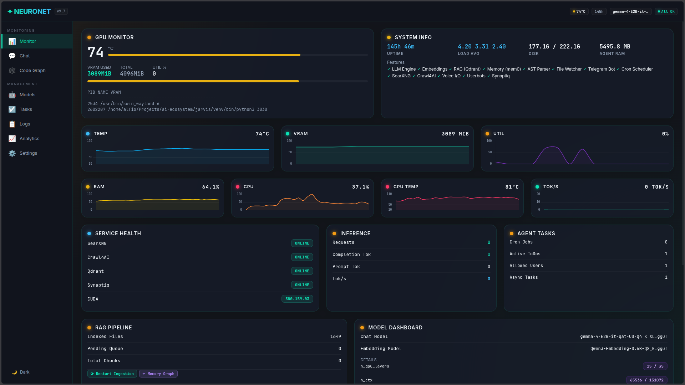

<p align="center">
  
</p>

<h1 align="center">NeuroNet — AI Cognitive Proxy</h1>

<p align="center">
  <b>Jarvis</b> — middleware cognitivo asincrono (FastAPI + Granian).<br/>
  Inferenza LLM locale, memoria episodica, RAG AST-aware, web intelligence, tool-calling agentico.
</p>

<p align="center">
  
  
  
  
</p>

---

## 📦 Quick Start

```bash
# Build e avvio Worker GPU
./start_worker.sh

# Test rapido
curl -X POST http://localhost:8000/api/chat \
  -H "Content-Type: application/json" \
  -d '{"model":"local","messages":[{"role":"user","content":"Ciao"}],"stream":false}'

# Log
docker logs jarvis_worker --tail=50 -f
```

> 📖 Configurazione completa: [`docs/SETUP.md`](docs/SETUP.md)

---

## 🔧 Config

```env
# Architettura
QDRANT_HOST=localhost
EXTERNAL_GPU_URL=

# Modello LLM
LLAMA_MODEL_PATH=./models/NomeModello.gguf
N_GPU_LAYERS=15
LLM_FLASH_ATTN=true

# RAG
MAIN_PROJECT_PATH=/host_fs/home/alfio/Projects
EMBEDDING_DIMS=768

# Watchdog
WATCHDOG_ENABLED=true
WATCHDOG_TIMEOUT=5
WATCHDOG_WATCH_MODE=per_project
```

> ⚙️ **73 variabili d'ambiente** configurabili dalla dashboard → [`AGENTS.md#4-configurazione-e-variabili-dambiente`](AGENTS.md#4-configurazione-e-variabili-dambiente)

---

## 🧠 Core Features

<details open>
<summary><b>🧠 Core AI & Inferenza</b></summary>

| Feature | File | Dettaglio |
|---|---|---|
| LlamaEngine singleton | `llm_engine.py` | Modelli GGUF in VRAM, PriorityLock chat > embedding |
| Flash Attention | `llm_engine.py` | -30-50% VRAM |
| GPU Offloading remoto | `llm_engine.py` | Worker remoto con failover 1.5s |
| Thinking Mode | `llm_engine.py` | `<\|think\|>` per Gemma / DeepSeek / QwQ |
| Compressione | `llm_engine.py` | Caveman mode con Qwen3.5 CPU |
| Model Profiles | `model_profiles.py` | Auto-rilevamento famiglia GGUF (7 famiglie) |

</details>

<details>
<summary><b>📚 RAG</b></summary>

| Feature | File | Dettaglio |
|---|---|---|
| AST Chunking semantico | `rag.py` | Tree-sitter per 9 linguaggi |
| Reranker duale | `rag_reranker.py` | Qwen3-Reranker + FlashRank fallback |
| Watchdog real-time | `rag.py` | PollingObserver, re-embedding automatico |
| Cache semantica | `rag_cache.py` | Soglia cosine 0.88 |
| Synaptiq Engine | `synaptiq_engine.py` | Grafo strutturale, hybrid search, dead code, impact, **graph visualization con Sigma.js** |

</details>

<details>
<summary><b>🧠 Memoria & Contesto</b></summary>

| Feature | File | Dettaglio |
|---|---|---|
| Memoria episodica | `memory.py` | Mem0 + Qdrant, metadati progetto |
| Ricerca filtrata | `memory.py` | Per `user_id` + `project` |
| Tag `<MEMORY>` | `tag_processor.py` | Salvataggio esplicito da risposta LLM |
| Consolidamento notturno | `reflection_agent.py` | Episodica → profilo sintetico (3:00 UTC) |

</details>

<details>
<summary><b>🧩 Prompt Builder & Gatekeeper</b></summary>

| Feature | File | Dettaglio |
|---|---|---|
| LLM Gatekeeper | `prompt_builder.py` | Classifica intento (keyword+regex+LLM) |
| Budget Allocator | `prompt_builder.py` | 55% RAG / 20% web / 10% mem / 15% tree, max 15K char |
| Super-prompt XML | `prompt_builder.py` | 7 tag contestuali |
| 21 tag d'azione | `tag_processor.py` | MEMORY, SCHEDULE, SSH, TODO, WEB, FILE, EXEC, COMMIT... |

</details>

<details>
<summary><b>🤖 Telegram & Userbot</b></summary>

| Feature | File | Dettaglio |
|---|---|---|
| Bot ufficiale | `telegram_bot.py` | Menu a bottoni, whitelist, admin panel |
| Multi-Userbot | `telegram_userbot_manager.py` | Clone per utente via OTP |
| Messaggi vocali | `telegram_bot.py` | Trascrizione faster-whisper + risposta gTTS |

</details>

<details>
<summary><b>🔧 Tool-Calling & Scheduling</b></summary>

| Feature | File | Dettaglio |
|---|---|---|
| Tool-calling nativo | `agent_tools.py` | 5 built-in tool + skill dinamiche |
| Conferma utente | `agent_tools.py` | Timeout 5 min per op. distruttive |
| APScheduler | `cron_agent.py` | CronTrigger, DateTrigger, timer relativi |
| Task Manager | `task_manager.py` | Task persistenti con priorità e scadenze |

</details>

<details>
<summary><b>🏗️ Infrastruttura & DevOps</b></summary>

| Feature | File | Dettaglio |
|---|---|---|
| CUDA 13.0 Overlay | `Dockerfile` | Base 12.2 + overlay 13.0 per driver 580.x |
| Dashboard web | `dashboard.py` | GPU / System / RAG metrics + **Settings panel (73 env var)** |
| OpenAI API | `openai/` | 25 endpoint: Chat, Audio, Assistants API |
| MCP Server v2 | `mcp_server_v2.py` | Streamable HTTP, 8 tool + 7 resources |
| Intent Classifier | `classificatore.py` | Classificazione intenti centralizzata |

</details>

---

## 🔄 Pipeline

```
Input → Routing → PipelineTracer → Gatekeeper (intento?)
       → Context Gathering [Web | Memoria | RAG | Synaptiq]
       → Super-prompt XML → LLM Generation
       → TagSafeStream → Tool-calling Loop → Output
```

> 📖 Diagramma dettagliato (9 step): [`docs/PIPELINE.md`](docs/PIPELINE.md)

---

## 🖥️ Admin Dashboard

Accessibile su `/admin/` (primario; `/dashboard` redirect 301). Login su `/admin/login`. Pannello suddiviso in **viste** con metriche in tempo reale.

| Vista | Cosa fa |
|---|---|
| **Monitor** | GPU, modelli, health services (Qdrant/SearXNG/Crawl4AI), statistiche inferenza, metriche sistema, errori |
| **Code Graph** | Visualizzazione Sigma.js delle collezioni Qdrant. Re-index e delete collection |
| **Management → Projects** | Progetti RAG registrati, pulsante 🧬 **Graph** per grafo Synaptiq per-progetto (nodi/relazioni simboli), Re-index con analisi automatica Synaptiq, Delete Collection |
| **Chat** | Streaming SSE in-browser, drag-drop file, shortcut `/` |
| **Management → Settings** | **73 env var** categorizzate in 12 gruppi. Tipi: text, number, float, boolean, select, secret. Simple/Advanced Mode. Badge ⚡ restart. Persistenza su `.env` |
| **Management → Models** | Lista GGUF, switch runtime |
| **Management → Tasks** | CRUD task con priorità/scadenze |
| **Management → Cron** | Job APScheduler, attivazione/pausa |
| **Management → Analytics** | Inferenza, telemetry, gatekeeper, error distribution |
| **Logs** | Docker logs viewer con filtro servizio e auto-scroll |
| **Management → Users** | User management CRUD (solo admin): crea, modifica, disabilita utenti, assegna ruoli/progetti |
| **Profile** | Self-service: cambio password, gestione API key (genera/revoca/rigenera), link Telegram ID |

### Architettura

```
jarvis/admin_panel/
├── __init__.py           # Router FastAPI, mount static files
├── templates/index.html  # Template HTML unico
└── static/
    ├── css/style.css     # Tema chiaro/scuro con CSS custom properties (~500 righe)
    └── js/
        ├── main.js       # Init, cambio view, polling
        ├── charts.js     # Chart.js (GPU, inference, RAG)
        ├── graph.js      # Sigma.js FA2 layout
        ├── chat.js       # Streaming SSE, drag-drop
        ├── telemetry.js  # Polling telemetry, Page Visibility API
        ├── management.js # Settings, Code Graph, Synaptiq Graph, Projects, Users, Models, Tasks, Cron, Analytics
        ├── logs.js       # Docker logs viewer
        └── utils.js      # fetchWithTimeout, showToast, escapeHtml
```

Backend API auth: `jarvis/routes/profile.py` (self-service: API key, password, Telegram), `jarvis/routes/users.py` (admin CRUD utenti), `jarvis/auth.py` (JWT login/logout/me). Backend settings: `jarvis/dashboard.py` — API Router FastAPI con `SETTINGS_META` (73 voci, metadati estesi) e `_persist_env()` (scrittura atomica `.env`).

---

## 🤖 Modelli

| Ruolo | Modello | Memoria | Velocità |
|---|---|---|---|
| **Chat (attivo)** | Gemma 4 E2B QAT (Q4_K_XL) | 1.036 MiB VRAM | ~6.88 tok/s |
| **Embedding** | Qwen3-Embedding-0.6B (Q8_0) | ~400 MiB VRAM | — |
| **Reranker** | Qwen3-Reranker-0.6B (fp16 CPU) | ~600 MB RAM | — |
| **Backup Chat** | Qwen3.5-4B (Q4_K_XL) | 1.924 MiB VRAM | ~6.24 tok/s |
| **Master (futuro)** | Gemma 4 26B A4B (Q4_K_XL) | ~14.2 GB RAM | ~8-12 tok/s |

Jarvis usa **solo `llama-cpp-python`** con file GGUF. Nessun Ollama.

---

## 🔌 Endpoint

| Categoria | Quantità |
|---|---|
| Jarvis nativi (`/api/*`) | 9 |
| OpenAI-compatibili (`/v1/*`) | 25 |
| Pipeline Telemetry | 8 |
| MCP v2 (Streamable HTTP) | 8 tool + 7 resources |

🆕 `GET /api/projects/{name}/synaptiq/graph` — grafo Synaptiq per progetto con Sigma.js
📖 Endpoint completi: [`docs/API_REFERENCE.md`](docs/API_REFERENCE.md)

---

## 📚 Documentazione

| File | Contenuto |
|---|---|
| [`AGENTS.md`](AGENTS.md) | **Guida per agenti AI** (leggi PRIMA di lavorare sul codice) |
| [`docs/ARCHITECTURE.md`](docs/ARCHITECTURE.md) | Topologia Master/Worker, flusso inferenza |
| [`docs/COMPONENTS.md`](docs/COMPONENTS.md) | Analisi completa 14 componenti con diagrammi |
| [`docs/PIPELINE.md`](docs/PIPELINE.md) | Flusso end-to-end Input → Response |
| [`docs/SETUP.md`](docs/SETUP.md) | Installazione, configurazione, modelli, manutenzione |
| [`docs/API_REFERENCE.md`](docs/API_REFERENCE.md) | Tutti gli endpoint API |
| [`docs/TAGS_REFERENCE.md`](docs/TAGS_REFERENCE.md) | Riferimento 21 tag XML d'azione |
| [`docs/STRATEGY.md`](docs/STRATEGY.md) | Strategia integrazione provider esterni |
| [`docs/CHANGELOG.md`](docs/CHANGELOG.md) | Storico versioni |

---

## ⚠️ CUDA 13.0 Overlay

Il container usa overlay **CUDA 13.0** su base 12.2 per driver NVIDIA 580.159.03.

```
nvidia-smi  # Se mostra CUDA Version: 13.0 → tutto ok
```

Se il container crasha con `ggml_cuda_can_mul_mat`, rebuildare:
```bash
docker compose -f docker-compose.worker.yml build --no-cache jarvis_worker
```

---

## 🌐 Provider Esterni

Jarvis è **100% locale**. Pianificata integrazione Gemini API come fallback per conoscenza enciclopedica, multimodalità e contesto 1M+ token.  
📖 [`docs/STRATEGY.md`](docs/STRATEGY.md)

---

<p align="center">
  <sub><b>NeuroNet</b> — Infrastruttura di Intelligenza Artificiale Locale Riservata.</sub>
</p>
