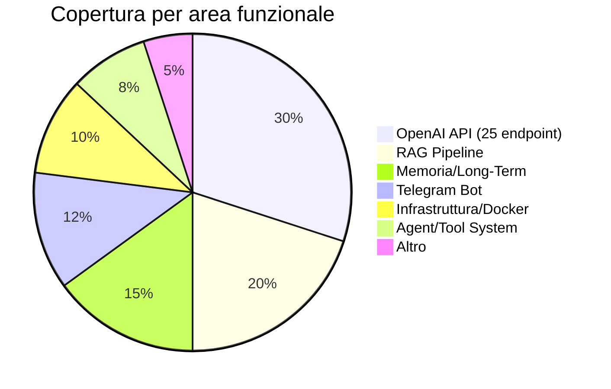
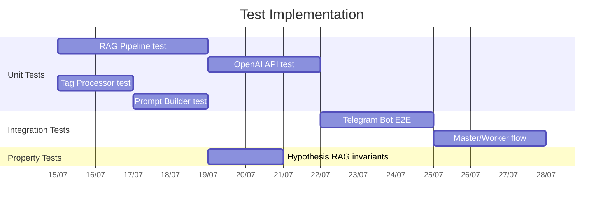
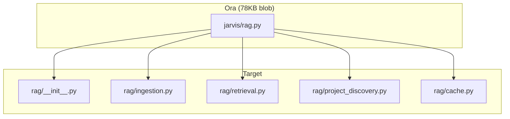
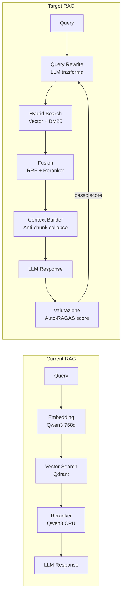
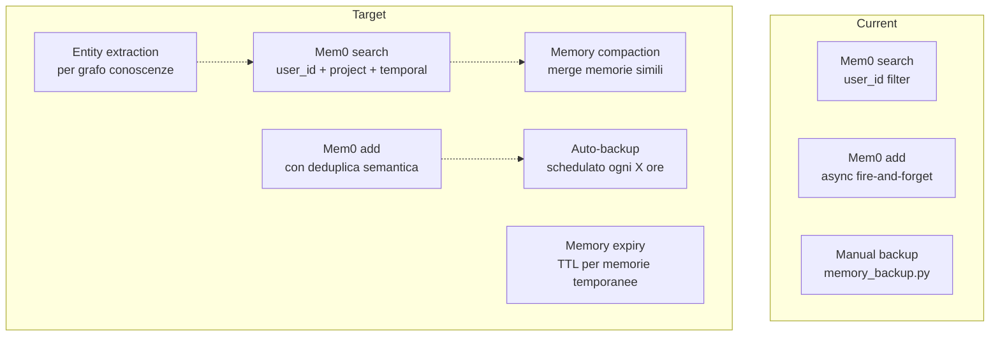
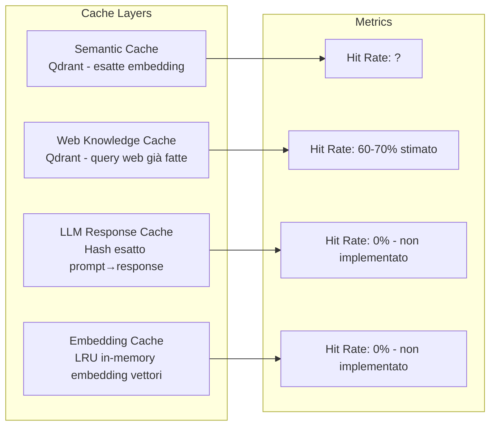
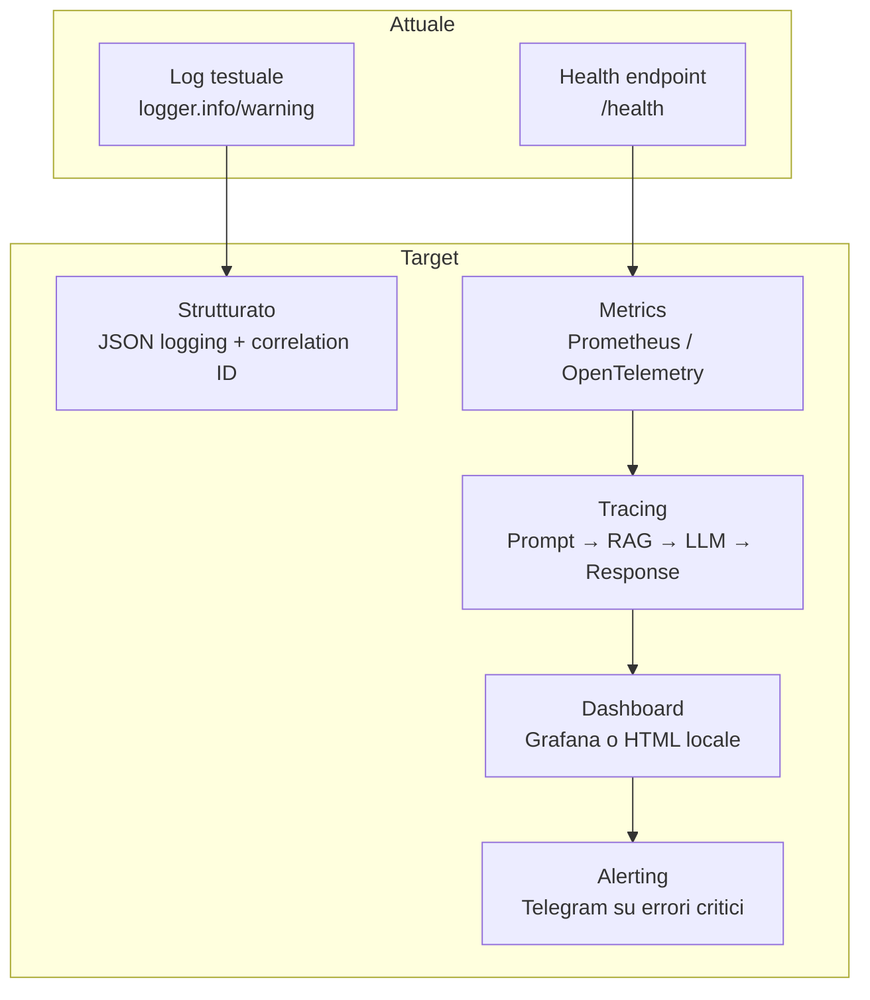
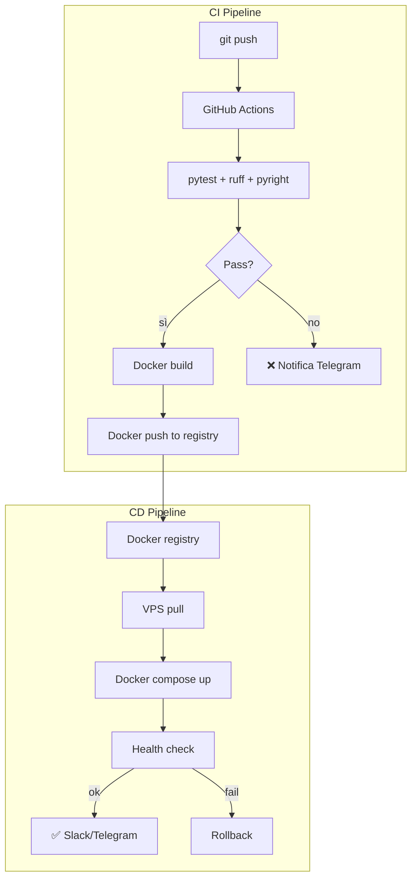
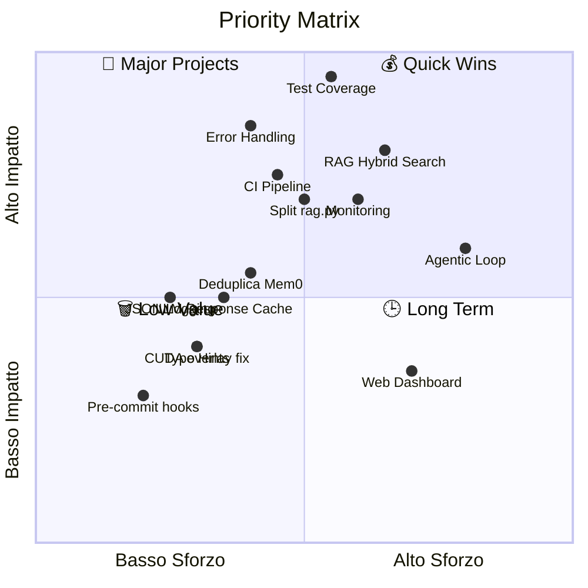
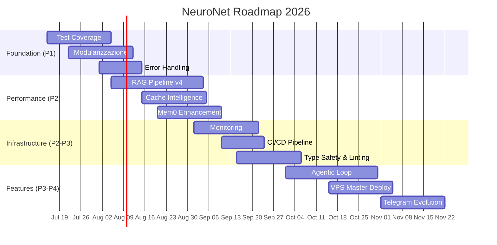

# 🗺️ NeuroNet Roadmap

> **Progetto:** Jarvis — Cognitive Proxy AI Locale  
> **Base:** FastAPI + Granian · llama-cpp-python · Qdrant · Mem0 · Telegram  
> **Versione piano:** 2026-07-15  
> **Totale codebase:** ~18K LOC · 45 moduli · 5 test

---

## 📊 Stato Attuale

| Metrica | Valore | Giudizio |
|---|---|---|
| **LOC totali** | ~18.000 | 🟡 Medio — cresciuto organicamente |
| **Moduli Python** | 45 | 🟡 Tanti per singolo developer |
| **Test** | 5 file · ~0% coverage | 🔴 **Critico** |
| **RAG chunk size** | 512 tok · 0 overlap | 🟡 Da rivalutare |
| **Modello principale** | Qwen2.5-Coder 3B GGUF | 🟢 Valido per coding |
| **Embedding** | Qwen3-Embedding-0.6B 768d Q8_0 | 🟢 Adeguato |
| **Reranker** | Qwen3-Reranker-0.6B (CPU) | 🟢 Attivo |
| **Mem0 persistenza** | Qdrant vettoriale | 🟢 Funzionante |
| **LLM engine** | llama-cpp-python in-process | 🟢 Performante |
| **VRAM totale** | Chat ~1036MiB + Embed ~400MiB | 🟢 Leggero |

---

## 🎯 Priorità Immediata (0-2 settimane)

### 🔴 P1 — Test Coverage

| Cosa | Perché | Sforzo |
|---|---|---|
| Test per `rag.py` (78KB) | Modulo più critico, zero test | ⏰ 3-4gg |
| Test per `tag_processor.py` | Streaming + stripping = bug subtili | ⏱️ 1-2gg |
| Test per `prompt_builder.py` | Gatekeeper + routing = core decisione | ⏱️ 1-2gg |
| Test per OpenAI `/v1/*` | 25 endpoint, compatibilità con client | ⏰ 2-3gg |
| Property-based (Hypothesis) | RAG invarianti, idempotenza persistenza | ⏰ 1-2gg |
| CI pipeline (GitHub Actions) | `pytest` su ogni push | ⏱️ 0.5gg |

**Target:** Coverage >60% · Zero regression su RAG + OpenAI API

---

### 🔴 P1 — Modularizzazione Monoliti

I modelli più grandi superano ogni limite ragionevole di manutenibilità:

| File | LOC | Problema | Azione |
|---|---|---|---|
| `jarvis/dashboard_template.py` | 93KB | Template HTML inline mostruoso | Estrarre in `templates/` + Jinja2 |
| `jarvis/rag.py` | 78KB | RAG + ingestion + search + cache | Già iniziata estrazione (`rag_cache.py`, `rag_reranker.py`) |
| `jarvis/telegram_bot.py` | 64KB | Bot + handlers + formattazione | Split in `telegram_handlers/` |
| `jarvis/prompt_builder.py` | ~2K righe | Prompt engineering + routing | Estrarre gatekeeper separato |

**Criterio di uscita:** Nessun file >2000 LOC · Ogni sottopackage ha `__init__.py` con API pubblica

---

## 🚀 Migliorie Architetturali (2-6 settimane)

### 🟠 P2 — RAG Pipeline v4

| Feature | Stato | Priorità |
|---|---|---|
| **Hybrid Search** (dense + sparse BM25) | ❌ Assente | 🟠 Alta |
| **Query Rewriting** (LLM trasforma query → query RAG) | ❌ Assente | 🟠 Alta |
| **Context Budget** (token budget dinamico per source) | ⚠️ Parziale | 🟡 Media |
| **Chunk Collapse Prevention** (evita chunk simili) | ❌ Assente | 🟠 Alta |
| **Auto-RAGAS Evaluation** (score su ogni retrieval) | ❌ Assente | 🟡 Media |
| **Cross-encoder reranking** (sostituire o affiancare) | ⚠️ Solo Qwen3 | 🟡 Media |
| **Workspace auto-discovery** (sostituire EXTERNAL_PROJECTS) | ❌ Solo piano rimosso | 🟠 Alta |

### 🟠 P2 — Mem0 & Memory System

| Feature | Stato | Priorità |
|---|---|---|
| **Deduplica semantica** (evita memoria duplicata) | ❌ Assente | 🟠 Alta |
| **Memory compaction periodico** | ❌ Solo backup JSON | 🟡 Media |
| **Entity graph** (estrazione entità → grafo) | ⚠️ spaCe ci ma non usato per grafo | 🟡 Media |
| **Temporal search** (filtra per timeframe) | ❌ Assente | 🟢 Bassa |
| **Memory TTL** (scadenza automatica) | ❌ Assente | 🟢 Bassa |

### 🟠 P2 — MCP Protocol & Skills System

MCP client esiste ma non è integrato nel flusso principale del gateway:

| Feature | Stato | Priorità |
|---|---|---|
| **MCP tool discovery** | ✅ Fatto | 🟢 Fatto |
| **MCP tool execution** | ✅ Fatto | 🟢 Fatto |
| **MCP → LLM tool routing** | ⚠️ Non usato in prompt builder | 🟠 Alta |
| **Skills YAML/MD → MCP bridge** | ✅ Fatto | 🟢 Fatto |
| **Skill-embedded MCP** | ✅ Fatto | 🟢 Fatto |
| **Tool-calling loop agentico** | ⚠️ Parziale (cron_agent.py) | 🟠 Alta |

---

## ⚡ Performance & Affidabilità (2-6 settimane)

### 🟡 P3 — Caching Intelligence

| Cache | Stato | Hit Rate Stimato | Azione |
|---|---|---|---|
| **Semantica** (query simili) | ✅ `rag_cache.py` | ? | Aggiungere monitoring |
| **Web Knowledge** (query web già fatte) | ✅ `save_web_knowledge()` | 60-70% | Aggiungere expiry |
| **LLM Response** (prompt identico) | ❌ Assente | 10-20% | Hash + TTL in Qdrant |
| **Embedding** (LRU in-memory) | ❌ Assente | 40-50% | `functools.lru_cache` o `cachetools` |
| **RAG chunk** (documenti raw) | ❌ Assente | Alta | Cache file-based |

### 🟡 P3 — Error Handling & Resilience

| Problema | Dove | Rischio | Fix |
|---|---|---|---|
| `except Exception` generici | Tutto il codebase | 🔴 Maschera errori reali | Tipizzare eccezioni |
| Timeout fissi | `prompt_builder.py:30s` | 🟡 Blocca su model lenti | Timeout dinamico per modello |
| Fire-and-forget senza retry | Mem0 save, Web save | 🟡 Perdita dati silenziosa | Retry policy + fallback log |
| Nessun rate limiting | API endpoints | 🟡 Abuso/DoS | `slowapi` o middleware |
| Race condition DB | `openai/state.py` | 🟡 Corruzione dati | Lock ottimistico |
| Graceful shutdown | `main.py` | 🟡 Connessioni troncate | Signal handler + drain |

### 🟡 P3 — Monitoring & Observability

| Metrica | Stato | Priorità |
|---|---|---|
| **JSON logging** (strutturato) | ❌ Solo testo | 🟡 Media |
| **Correlation ID** (traccia richieste) | ❌ Assente | 🟡 Media |
| **LLM latency P50/P95/P99** | ❌ Assente | 🟡 Media |
| **RAG retrieval score** | ❌ Assente | 🟡 Media |
| **Memory hit rate** | ❌ Assente | 🟢 Bassa |
| **Telegram error alerts** | ❌ Assente | 🟡 Media |
| **VRAM/CPU monitoring** | ❌ Assente | 🟢 Bassa |

---

## 🔧 Migliorie Codice & Manutenibilità (4-8 settimane)

### 🟡 P3 — Type Safety & Linting

| Area | Stato | Target |
|---|---|---|
| **Type hints** | ⚠️ Parziale (nuovo codice sì, legacy no) | `pyright strict` |
| **Linter** | ❌ Nessuno | `ruff` con regole complete |
| **Formatter** | ❌ Nessuno | `ruff format` o `black` |
| **Pre-commit hooks** | ❌ Assenti | `pre-commit` con ruff + pyright |

### 🟡 P3 — Refactoring Patterns

| Pattern tossico | Dove | Fix |
|---|---|---|
| `from X import *` | `rag.py` top | Import espliciti |
| Moduli > 2000 LOC | `rag.py`, `telegram_bot.py`, `dashboard_template.py` | Split modulare |
| Incrocio dipendenze circolari | `state.py` ↔ `rag.py` ↔ `prompt_builder.py` | Dependency injection |
| Hardcoded path | `DATA_DIR`, `MODELS_DIR` in 5+ file | Config singleton |
| Magic number | `512` chunk, `768` dims, `20` messaggi | Costanti nominate |

---

## 🏗️ Infrastruttura & Deploy (4-8 settimane)

### 🟡 P3 — Docker & CI/CD

| Task | Stato | Priorità |
|---|---|---|
| **Docker multi-stage build** (dev/prod separati) | ⚠️ Singolo stage | 🟡 Media |
| **CUDA 13.0 overlay fix** | ✅ Risolto ma workaround | 🟡 Media |
| **Healthcheck Docker** | ❌ Assente | 🟢 Bassa |
| **GitHub Actions CI** | ❌ Assente | 🟡 Media |
| **Auto-deploy VPS** | ❌ Manuale | 🟢 Bassa |
| **Rollback strategy** | ❌ Assente | 🟢 Bassa |

---

## 💡 Feature Roadmap (8+ settimane)

### 🔵 P4 — Agent System

| Feature | Descrizione | Dipendenze |
|---|---|---|
| **Agentic Loop** (tool-calling nativo) | LLM sceglie tool, esegue, osserva risultato | MCP integration |
| **Sub-agent spawn** | Agente principale spawna agenti specializzati | Agentic loop |
| **Scheduled reflection** | Consolidamento automatico memorie | Cron agent |
| **Multi-agent orchestration** | Agent coordinator + message bus | Sub-agent spawn |

### 🔵 P4 — Telegram Bot Evolution

| Feature | Priorità |
|---|---|
| **Interactive buttons** (inline keyboard per conferme) | 🟡 Media |
| **Media streaming** (audio diretto senza download) | 🟢 Bassa |
| **Multi-language responses** | 🟢 Bassa |
| **Group chat support** | 🟢 Bassa |

### 🔵 P4 — VPS Master Node

| Feature | Stato | Priorità |
|---|---|---|
| VPN Tailscale | ⚠️ Configurato | 🟡 Media |
| Queue worker | ⚠️ `start_worker.sh` | 🟡 Media |
| Failover automatico | ❌ Assente | 🟢 Bassa |
| Web dashboard | ⚠️ `dashboard.py` + template 93KB | 🟡 Media |

---

## 📈 Matrice Priorità

---

## 📋 Roadmap Temporale

---

## 🏁 Criteri di Completamento

Ogni area ha un criterio oggettivo per considerarsi *done*:

| Area | Done Quando |
|---|---|
| **Test Coverage** | `pytest --cov=jarvis --cov-fail-under=60` passa |
| **Modularizzazione** | Nessun file Python > 2000 LOC |
| **RAG Pipeline v4** | Hybrid search attivo, chunk collapse zero, query rewrite integrato |
| **Mem0 Enhancement** | Deduplica + compaction schedulato + backup automatico |
| **Monitoring** | Tutte le richieste hanno correlation ID, metriche Prometheus esposte |
| **Error Handling** | Zero `except Exception` senza commento che giustifichi |
| **Type Safety** | `pyright --level strict` passa su tutto il codebase |
| **CI/CD** | `git push` → test + lint + build + deploy automatico |
| **Agentic Loop** | LLM chiama tool MCP, osserva risultato, decide iterazione |

---

## 🤝 Come Contribuire

1. Scegli un'area dalla matrice priorità (Quick Wins = miglior rapporto impatto/sforzo)
2. Verifica stato attuale nel codebase
3. Implementa con TDD (test che fallisce → codice → test che passa)
4. `pre-commit` hook esegue ruff + pyright prima del commit
5. Crea PR con descrizione del cambiamento e impatto misurato

---

> 📖 **Vedi anche:** [`docs/AGENTS.md`](docs/AGENTS.md) per contesto operativo completo · [`README.md`](README.md) per stato sistema
