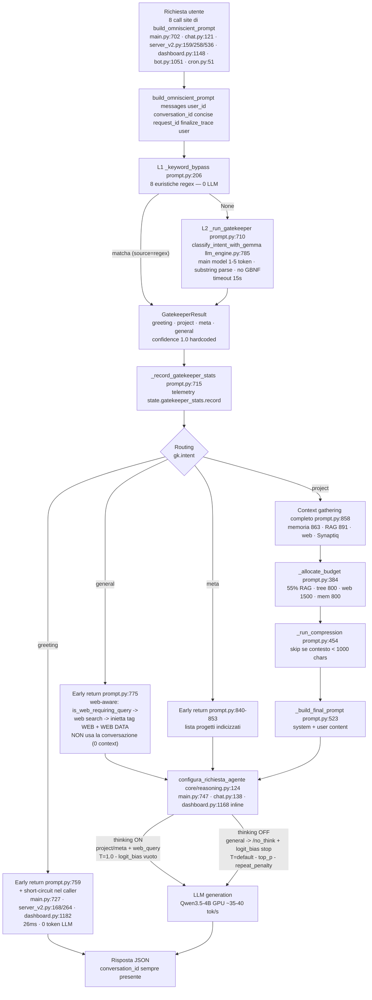
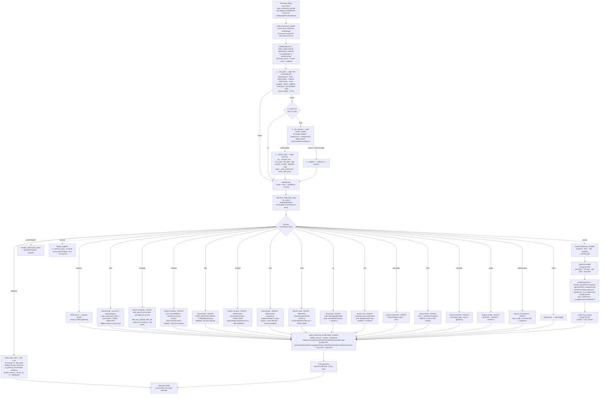

# 🧠 Piano di Consolidamento: Intent Understanding LLM-based per Jarvis

> **Data:** 2026-08-01 (v4 — **release finale: retro-compatibilità eliminata**. Architettura a 2 componenti: intent handler + context compressor. Nessun kill switch, nessuna proiezione, nessun alias, nessun fallback al codice legacy — migrazione pulita con aggiornamento diretto di tutti i consumer)
> **Data precedente:** 2026-07-31 (v3 — architettura a 2 componenti: intent handler + context compressor)
> **Stato:** ✅ **Fasi 1-5 COMPLETATE e VERIFICATE** (02/08: 31/31 fast-path + benchmark 100% intent / 100% slot + 31/31 handler + E2E live su tutti i canali + Fase 5 consolidamento con rename Gatekeeper→Intent/Compressor, grep release = 0 + commit pushati). Prossima: Fase 6 (compatibilità client agentici).
> **Proprietario:** Alfio Saitta / Collateral Studios
> **File correlati:** `agent/prompt.py`, `agent/classifier.py`, `agent/intent_router.py` (nuovo), `agent/context_compressor.py` (nuovo), `core/llm_engine.py`, `core/reasoning.py`, `core/config.py`, `core/telemetry.py`, `rag/web_search.py`, `main.py`, `openai_api/chat.py`, `openai_api/models.py`, `api/mcp/server_v2.py`, `admin/dashboard.py`, `admin/settings_manager.py`, `tg_bot/bot.py`, `scheduler/cron.py`

---

## Indice

1. [Executive Summary](#1-executive-summary)
2. [Analisi dell'Architettura Attuale (verificata)](#2-analisi-dellarchitettura-attuale-verificata)
3. [Problemi Identificati](#3-problemi-identificati)
4. [Soluzione Proposta: IntentRouter ibrido LLM+Regex](#4-soluzione-proposta-intentrouter-ibrido-llmregex)
5. [Architettura del Nuovo Modulo](#5-architettura-del-nuovo-modulo)
6. [Fasi di Implementazione (con punti di integrazione esatti)](#6-fasi-di-implementazione-con-punti-di-integrazione-esatti)
7. [Metriche di Successo](#7-metriche-di-successo)
8. [Rischi e Mitigazioni](#8-rischi-e-mitigazioni)
9. [Rollback](#9-rollback)
10. [Note Tecniche e Comandi di Test](#10-note-tecniche-e-comandi-di-test)

## Tabella Comparativa Features: Prima vs Dopo

> Sintesi ad alto livello delle capacità prima e dopo l'implementazione. Dettagli tecnici (file:line verificati) in §2, §5 e §6.

| # | Feature | Prima (attuale) | Dopo (post-implementazione) |
|---|---|---|---|
| 1 | **Classificazione intenti** | 3 intent (`project`/`meta`/`general`) via substring parse, senza grammatica, confidence hardcoded | **22 intent** — 18 via **GBNF** su main model (`project`/`general`/`web`/`schedule`/`meta`/`action`/`memory`/`task`/`analyze`/`plan`/`code`/`git`/`ssh`/`transcribe`/`fetch`/`translate`/`config`/`maintenance`) + 4 deterministici tier-0 (`greeting`/`confirm`/`reject`/`internal`) + fallback a catena |
| 2 | **Estrazione parametri (slot)** | **Assente (0%)** — "tra 30 minuti", "a Catania" persi nel testo | **Regex post-hoc**: `city`, `duration_min`, `cron_expr`, `file_path`, `topic`, `content`, `priority`, `deadline` |
| 3 | **Greeting** | 26ms, ma logica short-circuit **copiata ×4** (main.py:727, server_v2.py:168/264, dashboard.py:1182) | 26ms, **tier-0 regex centralizzata** in `_fast_path()` + helper `is_greeting_result` — **mai LLM** (safety-net opzionale Fase 4.6) |
| 4 | **Web query naturali** | "che tempo fa a Catania" → `general` + regex `_LIVE_DATA_RE` nel branch | Intent `web` + slot `{topic: weather, city: Catania}` → web search diretta |
| 5 | **Promemoria naturali** | **Impossibile** — "ricordami tra 30 minuti di X" → `general`, dati persi | Intent `schedule` + slot `{duration_min: 30, message}` → `add_relative_job()` (cron.py:110); `add_cron_job`/`add_date_job` (cron.py:74/91) per ricorrenze e date |
| 6 | **Compressione contesto** | Annegata in `prompt.py` (`_run_compression`, 454-516) sotto il nome "gatekeeper" | **Modulo autonomo** `agent/context_compressor.py` — `compress()` invariato, skip < 1000 chars conservato |
| 7 | **Telemetria** | `gatekeeper_stats` (no tracciamento per sorgente) | `intent_stats` + `by_source` (regex/llm/fallback) — **rename pulito**, nessun alias |
| 8 | **Configurazione** | `GATEKEEPER_MODEL_PATH` / `GATEKEEPER_N_CTX` / `GATEKEEPER_N_GPU_LAYERS` | `COMPRESSOR_*` — **rename pulito**, `.env` migrato una tantum (Fase 5.6), nessun fallback |
| 9 | **Duplicazioni routing** | Greeting ×4, `configura_richiesta_agente` 3 siti + 1 loop inline divergente | Helper condivisi: `is_greeting_result`, `apply_reasoning_config` |
| 10 | **Kill switch** | Assente | **Eliminato dalla release finale** — nessun ritorno al vecchio comportamento (il codice legacy viene cancellato). Catena fissa: fast_path → cache → LLM → `general` |
| 11 | **Nome "gatekeeper"** | 3 responsabilità mescolate (regex + classifier + compressor) | **Sparisce**: 2 componenti separati (`intent_router` + `context_compressor`) |
| 12 | **Architettura routing** | 6 layer di interpretazione distribuiti (L1-L6, §2.1) | 1 modulo centralizzato (`intent_router.classify`) + 3 tier interni |
| 13 | **Contratto API** | `GatekeeperResult` a 4 valori + proiezione | `IntentResult` **nativo** ovunque: `GatekeeperResult` cancellato, firma `build_omniscient_prompt` aggiornata per restituire `IntentResult`, **tutti gli 8 call site migrati** in un unico commit (Fase 3.5) |
| 14 | **Memoria episodica naturale** | Solo tag `<MEMORY>` generato dalla risposta LLM | Intent `memory` + slot `content` → `memory/engine.py` save/retrieve (filtro user+project) |
| 15 | **Task management naturale** | Solo tag `<TODO_ADD>`/`<TODO_DONE>` dalla risposta | Intent `task` + slot `priority`/`deadline` → `scheduler/tasks.py` con feedback nel testo |
| 16 | **Analisi codice (read-only)** | Solo `<THINK_DEEP>` manuale | Intent `analyze` (explain/diagnose/performance) → reasoning ON + contesto — **mai modifiche** |
| 17 | **Pianificazione (read-only)** | Assente — proposte inline nel testo | Intent `plan` → proposta di implementazione a passi, output = piano testuale, **nessuna modifica** |
| 18 | **Modifica codice** | `refactor`/`debug` mescolati all'analisi sotto `<THINK_DEEP>` | Intent `code` (refactor/implement/fix) → **conferma** via `ConfirmationProvider.ask` + reasoning ON |
| 19 | **Gestione per intent (routing)** | Branch inline nel prompt builder, soglie assenti | `DISPATCH_TABLE` intent→handler (§4.3) + soglie di confidenza per tier + fallback sicuro a `general` |
| 20 | **Git operations** | Solo tag `<COMMIT>`/`<BRANCH>` dalla risposta | Intent `git`: status/log/diff read dirette · commit/branch/push con conferma |
| 21 | **SSH remoto** | Solo tag `<SSH>` manuale | Intent `ssh`: comandi remoti read diretti · write con whitelist + conferma |
| 22 | **Trascrizione audio** | Solo API `/v1/audio/transcriptions` | Intent `transcribe`: voce/audio → testo via faster-whisper |
| 23 | **Fetch URL** | Solo `/web` su URL (via search) | Intent `fetch`: URL → contenuto via Crawl4AI, distinto dalla search |
| 24 | **Traduzione** | Implicita nel branch general | Intent `translate`: slot `target_lang` + risposta diretta, nessun gathering |
| 25 | **Configurazione** | Solo dashboard Settings manuale | Intent `config`: get read-only · set/reset via `_persist_env` + conferma |
| 26 | **Manutenzione** | Solo comandi manuali | Intent `maintenance`: `<CACHE_CLEAR>`, reindex RAG, cleanup collezioni — distruttive con conferma |
| 27 | **Compatibilità client agentici (OpenCode)** | `/v1/chat/completions` base: `content` solo `str`, `tool_calls` scartati silenziosamente, loop tool-calling **server-side** (mai `tool_calls` al client — chat.py:371) | **Modalità `agentic` NATIVA** (rilevamento automatico `tools` nel body — nessuna env di modalità): `content` array + `tool_calls`/`tool_call_id` preservati, loop **client-driven** (Jarvis non esegue MAI server-side), intent→capacità del client nel prompt (`<CLIENT_TOOLS>`) |
| 28 | **`reasoning_effort`** | Ignorato (assorbito da `extra="allow"`, mai letto — models.py:37) | Mappato: `high\|medium` → thinking ON · `low\|absent` → OFF (default per intent, §3.3) |
| 29 | **`stream_options.include_usage`** | Ignorato | Chunk finale con `usage` (prompt/completion/total tokens) prima di `data: [DONE]` |

## Performance: Prima vs Dopo (stima)

> Stima basata su dati verificati: benchmark modello AGENTS.md (2026-07-27: Qwen3.5-4B ~35-40 tok/s full GPU), latenza gatekeeper attuale (~0.3-0.8s, llm_engine.py:785) e metriche target del piano (§7). I valori "dopo" sono stime di progetto, da confermare col benchmark Fase 2 (§10.3).

| Metrica | Prima (attuale) | Dopo (stima) | Δ | Note |
|---|---|---|---|---|
| **Latenza greeting** (messaggio più frequente) | **26ms** · 0 token LLM | **26ms** · 0 token LLM | **=** | Tier-0 regex preservata in `_fast_path()` — mai LLM (safety-net opzionale Fase 4.6). Prima del fix 29/07 erano 60-76s: la soglia è protetta |
| **Latenza classificazione intent** (query non-bypassate) | **0.3-0.8s** · 1-5 token substring | **0.5-1.5s** · GBNF ≤ 60 token | **+0.2-0.7s tipico** (fino a +1.2s worst) | **Unica perdita attesa.** Trade-off esplicito: precisione ≥95% invece di ~85% (substring parse fragile, §2.4). Mitigata da cache + tier-0 |
| **Latenza su query ripetute** | n/a — sempre chiamata LLM | **~0ms** (cache LRU TTL 60s) | **—** | Nuovo beneficio: le stesse domande (comuni in sessione) non riclassificano |
| **Slot extraction** (city, duration_min, file…) | **Non esiste** | **<1ms** (regex post-hoc) | **—** | Nuova capacità a costo trascurabile — zero token LLM |
| **Token per classificazione** | 1-5 | ≤ 60 | **+** | Output GBNF JSON più ricco → 18 intent + confidence reali |
| **VRAM aggiuntiva** | 0 | 0 | **=** | Main model già in VRAM (stesso pattern di `classify_intent_with_gemma`, 0 VRAM extra) |
| **Throughput generazione risposta** | **35-40 tok/s** | **35-40 tok/s** | **=** | Nessun impatto sull'inferenza: cambia solo il pre-routing |
| **Compressione contesto** | Qwen0.8B CPU · skip < 1000 chars | **Identica** (modulo estratto `context_compressor.py`) | **=** | Zero cambi comportamentali, stesso modello, stessa soglia |
| **Pipeline RAG/project** (gathering + compressione + generazione) | invariata | invariata | **=** | I componenti a valle non vengono toccati |
| **Precision intent** (impatto indiretto su latenza) | ~85% | **≥ 95%** | **+** | Meno re-routing errati → meno web search/RAG inutili e risposte sbagliate da ripetere |

**Riepilogo del trade-off:** il piano **non tocca** le parti calde (greeting 26ms, generazione 35-40 tok/s, compressione, pipeline RAG). Aggiunge ~0.2-0.7s tipici solo sulle query che oggi passano comunque dal gatekeeper LLM (non-bypassate), in cambio di precisione ≥95%, slot extraction e cache — che su query ripetute rende la classificazione **più veloce di oggi** (~0ms vs 0.3-0.8s). Il costo massimo (≤1.5s) è entro il timeout di classificazione già esistente (15s).

---

## 1. Executive Summary

Jarvis interpreta la richiesta dell'utente attraverso **6 layer di interpretazione distribuiti e incoerenti** (regex, LLM senza grammatica, LLM con grammatica ma **morto**, classificatore separato quasi morto), con **duplicazioni di costanti e di logica di routing** in almeno 4 file diversi.

Questo piano centralizza l'intent understanding in un unico modulo `agent/intent_router.py` con architettura **ibrida pragmatica**, e **separa le 2 responsabilità** oggi mescolate sotto il nome "gatekeeper": **classificazione intenti** (`intent_router`) e **compressione contesto** (`context_compressor`, nuovo modulo autonomo). Il nome "gatekeeper" sparisce dal sistema.

| Compito | Strumento | Perché |
|---|---|---|
| **Intent classification** (18 LLM: project/general/web/schedule/meta/action/memory/task/analyze/plan/code/git/ssh/transcribe/fetch/translate/config/maintenance) | **LLM main model + GBNF** | Il modello capisce la lingua; la grammatica vincola il formato. Pattern già collaudato in `classify_intent` (anche se oggi dormiente) |
| **Slot extraction** (city, duration_min, file_path...) | **Regex post-hoc dedicate** | La GBNF attuale (`llm_engine.py:733-739`) supporta solo `word` alfanumeriche SENZA spazi → "chiamare Marco" sarebbe JSON invalido. Gli slot liberi vanno estratti con regex, dove eccellono |
| **Casi deterministici** (greeting puro, `/web`, token conferma, query interne) | **Regex tier-0** | Latenza 26ms del greeting short-circuit va PROTETTA: mai LLM per i saluti |
| **Fallback** | LLM → regex legacy → `general` | LLM → `general` (i casi deterministici sono già nel fast-path; nessun layer regex legacy residuo) | Mai crash, mai intent sbagliato senza via di fuga |
| **Context compression** (contesti lunghi) | **Qwen0.8B CPU**, estratto in `agent/context_compressor.py` | La compressione è ortogonale all'intent understanding: isolata in un componente autonomo (skip < 1000 chars conservato) |

**Risultato atteso:** Jarvis capisce *cosa* gli viene chiesto (intent) e *con quali parametri* (slot), abilitando autonomia reale (promemoria naturali, ricerca web senza `/web`, azioni contestuali) **senza accumulare altre regex** e senza regressioni sui 4 greeting short-circuit esistenti. Il **greeting resta tier-0 regex** nel gestore intenti (26ms preservati; l'LLM al massimo come safety-net opzionale, mai prima opzione). La **compressione contesto** sopravvive come componente separato.

**Vincolo implementativo:** nessun sub-agent per l'implementazione (lavoro diretto, come da richiesta utente). **Nessuna retro-compatibilità**: codice legacy cancellato, consumer migrati nello stesso commit, `.env` migrato una tantum.

---

## 2. Analisi dell'Architettura Attuale (verificata)

> Tutti i riferimenti `file:line` sotto sono stati **verificati sul codice al 2026-07-31**. Un agente implementatore può fidarsi ciecamente di questi anchor.

### 2.1 Inventario dei layer di interpretazione

| # | Layer | File:line | Meccanismo | Output | Stato |
|---|-------|-----------|------------|--------|-------|
| L1 | Keyword Bypass | `agent/prompt.py:206` `_keyword_bypass()` | 8 euristiche: guard `len<3` → general (212-213), greeting puro (218-236), JSON dump (243-245), nome progetto (247-253), `META_PHRASES` (255-257), `SIMPLE_QUERIES` (260-262), `PROJECT_KEYWORDS` (264-267), path regex (268-270) | `GatekeeperResult` (0 LLM) o `None` → STEP 2 | **ATTIVO** |
| L2 | LLM Gatekeeper | `core/llm_engine.py:785` `classify_intent_with_gemma()` | Main model (`model="chat"`), `temperature=0.0`, `num_predict=5`, `max_tokens=10`, `stop=["\n","|"]`, `priority=1`, timeout 15s (`asyncio.wait_for` riga 823-830). **Parsing substring**: `"project" in content → 0.95`, `"meta" in content → 0.95`, else `general → 0.80` (838-846). Project name via variant matching (850-860) | `intent ∈ {project, meta, general}` + confidence **hardcoded** | **ATTIVO** (usato da `_run_gatekeeper` prompt.py:286) |
| L3 | LLM Gatekeeper legacy | `core/llm_engine.py:690` `classify_intent()` | Qwen0.8B (`model="gatekeeper"`) + **grammatica GBNF** (`LlamaGrammar.from_string` riga 742, grammar a 733-739) → JSON via `re.search(r'\{.*\}')` + `json.loads` | `intent` + `project` + `confidence` | **MORTO** — nessun consumer (unica occorrenza è la definizione; `_run_gatekeeper` chiama solo `classify_intent_with_gemma`) |
| L4 | Classificatore separato | `agent/classifier.py` (188 righe) | `Intent` enum (50-61), `CONFIRM/REJECT_PATTERN` (23-24), `classify_confirmation` (68-88), `is_project_query` (91-111), `is_greeting` (114-118), `is_web_query` (121-123), `is_internal_query` (126-143), `classify` (146-175), `needs_rag` (178-180), `needs_confirmation` (183-188) | Vari | **QUASI MORTO**: solo `is_internal_query` (import `main.py:54`, **uso `main.py:664`**, `openai_api/chat.py:113`) e `classify_confirmation` (usato in `core/chat_utils.py:54` → `handle_confirmation_token`) |
| L5 | Web detection | `rag/web_search.py:32-70` (regex `_LIVE_DATA_RE`/`_WEB_INSTRUCTION_RE`) · funzioni `is_web_requiring_query()` (**81**) + `clean_web_query()` (**93**) | regex meteo/news/prezzi/ricerca esplicita, con preposizioni articolate "sul"/"nel"/"sulla" | bool + query pulita | **ATTIVO** (branch general web-aware, aggiunto 2026-07-31) |
| L6 | Super-tags | `agent/prompt.py:331` `_parse_super_tags()` | Regex `<PERSONA>`, `<FOCUS>`, `<LANG>`, `<MEMORY_COUNT>` | override dict `{persona, focus, lang, mem_count}` | **ATTIVO** |

### 2.2 Duplicazioni e codice morto (verificati)

| Duplicazione | Dove | Impatto |
|---|---|---|
| `PROJECT_KEYWORDS` | `prompt.py:129-141` **e** `classifier.py:26-38` | Identiche al 100%, mai sincronizzate |
| Greeting words | `prompt.py:218` `PURE_GREETINGS` (frozenset) **e** `classifier.py:40-44` `GREETING_WORDS` (set, semantica diversa) | Due set diversi con scopi diversi — il secondo è morto |
| **Greeting short-circuit** | `main.py:727`, `api/mcp/server_v2.py:168` (chat_send), `api/mcp/server_v2.py:264` (jarvis_chat), `admin/dashboard.py:1182` | Stessa logica `if gk_result and gk_result.intent == "greeting"` copiata 4 volte, con risposte leggermente diverse (main/server_v2: "Ciao! 👋 Come posso aiutarti?"; dashboard: lista `greeting_responses`) |
| **`configura_richiesta_agente` + injection `/no_think`** | Chiamato in `main.py:747`, `openai_api/chat.py:138`, `admin/dashboard.py:1168`. Il dashboard ha la **propria re-implementazione inline** del loop di injection (1161-1179) invece di riusare un helper | 3 siti + 1 re-implementazione divergente |
| `Intent` enum | `classifier.py:50-61` | 7 valori ma mai usati dal routing reale |
| `classify_intent` (L3) | `llm_engine.py:690-779` | 90 righe + grammatica GBNF, **nessun consumer** |

### 2.3 Flusso attuale di routing (verificato)



**Dettagli del GatekeeperResult** (`core/llm_engine.py:90`): `intent: str` ("project"|"meta"|"general"), `project: str | None`, `confidence: float`. **(Release finale)** il tipo viene **eliminato** in Fase 3: nessun `extended_intent`, nessuna proiezione — tutti i consumer migrano a `IntentResult` nativo (22 intent, contratto §5.7).

**Firma di `build_omniscient_prompt`** (`prompt.py:595`) — stato ATTUALE:
```python
async def build_omniscient_prompt(
    messages, user_id=None, conversation_id="default",
    concise=False, request_id=None, finalize_trace: bool = True, user=None,
) -> tuple[list, GatekeeperResult | None]
```
**Release finale (Fase 3):** il tipo di ritorno diventa `tuple[list, IntentResult | None]` — gli 8 call site (Fase 3.5) leggono `IntentResult.intent` nativo. Parametri invariati (nessun consumer toccato sulla firma).

### 2.4 Limiti del classificatore LLM attuale (verificati)

`classify_intent_with_gemma` (L2):
- **3 intent soltanto** (`project|meta|general`); `greeting` è gestito solo dal bypass regex (L1)
- **Nessuna slot extraction**: "che tempo fa a Catania" → `general`, senza estrarre `city=Catania` né `topic=weather`
- **Confidence fittizia**: hardcoded `0.95`/`0.95`/`0.80` — non riflette la vera certezza; nessun consumer la usa per decidere (solo telemetry)
- **Parsing substring fragile** (838-846): `"project" in content` — un output "not a project request" conterrebbe "project" → falso positivo
- **Project extraction solo via nome nel messaggio** (850-860): fallisce se il progetto è nel contesto di conversazione

`classify_intent` (L3, GBNF):
- Grammatica verificata (733-739): `string ::= "\"" word "\""` con `word ::= [a-zA-Z] ([a-zA-Z0-9_.-])*` → **NON supporta spazi né caratteri accentati** ("chiamare Marco", "tra 30 minuti" → invalido). La grammatica è adatta SOLO a intent+confidence, non a slot liberi
- Dead code — nessun consumer; il pattern GBNF è però il riferimento giusto per l'intent classification

---

## 3. Problemi Identificati

| ID | Problema | Impatto | Evidenza verificata |
|----|----------|---------|---------------------|
| P1 | **Regex fragile** per interpretazione | Falsi negativi/positivi, manutenzione infinita | Bug 2026-07-31: "che tempo fa a Catania" non matchava `SIMPLE_QUERIES` (`$` anchor, prompt.py:260) → dati stantii. Fix = altra regex (`_LIVE_DATA_RE`) |
| P2 | **Nessuna estrazione parametri** | Il sistema sa l'intent ma non gli argomenti | "promemoria tra 30 minuti di chiamare Marco" → `general`; tempo/azione persi |
| P3 | **Duplicazione costanti** | Divergenza silenziosa | `PROJECT_KEYWORDS` identico in `prompt.py:129` e `classifier.py:26`, mai allineato |
| P4 | **Duplicazione logica routing** | Bug fissati in un punto restano negli altri | Greeting short-circuit ×4 (main.py:727, server_v2.py:168/264, dashboard.py:1182); injection `/no_think` ×3+1 re-implementazione inline |
| P5 | **Codice morto** | Confusione manutentori, lavoro doppio | `classifier.py` 188 righe con 2 sole funzioni vive; `classify_intent` L3 90 righe senza consumer |
| P6 | **LLM sotto-utilizzato** | Il modello capisce la lingua ma il sistema no | Gatekeeper 1-5 token substring, senza grammatica né slot |
| P7 | **Confidence inaffidabile** | Impossibile decidere "quando fidarsi" | Hardcoded 0.95/0.80 (llm_engine.py:840-846); nessun consumer la usa per decisioni |
| P8 | **Decisioni distribuite** | Ogni regex vive nel proprio modulo, nessuna orchestrazione | `_LIVE_DATA_RE` in web_search.py, `SIMPLE_QUERIES` in prompt.py, `is_internal_query` in classifier.py, path regex in prompt.py:268 |
| P9 | **"Gatekeeper" = 3 responsabilità mescolate** | Nome ambiguo, accoppiamento di concetti indipendenti | `_keyword_bypass` (regex greeting, prompt.py:206), `classify_intent_with_gemma` (classifier main model, llm_engine.py:785), `engine.compress_prompt` (compressor Qwen0.8B, guidato da `GATEKEEPER_MODEL_PATH`) — tre cose diverse con un solo nome |

---

## 4. Soluzione Proposta: IntentRouter ibrido LLM+Regex

### 4.1 Principi (rivisti dopo verifica)

1. **LLM-first per l'INTENT**: il main model (già in VRAM, 0 VRAM extra) classifica l'intento con **output JSON vincolato da GBNF** — ma la grammatica produce **solo `intent` + `project` + `confidence`** (come `classify_intent`), MAI slot liberi
2. **Regex per gli SLOT**: city, duration_min, file_path, topic vengono estratti da **regex post-hoc dedicate** sul messaggio originale (pattern già esistenti in `web_search.py` come base). Le regex eccellono su stringhe strutturate ("tra N minuti", "a Catania", "auth.py")
3. **Regex tier-0**: greeting puro (26ms short-circuit), `/web`, token conferma, query interne → regex, **centralizzate** in `intent_router.py` (ereditate da `_keyword_bypass`, non legacy — parte del nuovo modulo)
4. **Fallback a catena**: LLM → default `general`, mai crash (niente layer regex legacy residuo: i casi deterministici sono già nel fast-path)
5. **Nessun kill switch**: il codice legacy (gatekeeper, classifier, proiezioni) viene **cancellato** nella release finale — nessun ritorno al comportamento attuale
6. **Contratto nativo `IntentResult`**: `GatekeeperResult` è **eliminato**; `build_omniscient_prompt` restituisce `IntentResult` e **tutti gli 8 call site vengono migrati** (Fase 3.5) — niente proiezioni, niente `extended_intent`
7. **Separazione compressione**: la compressione contesto (Qwen0.8B) è estratta in `agent/context_compressor.py` con API propria. Il nome "gatekeeper" scompare: restano **2 componenti** — `intent_router` (classificazione) e `context_compressor` (compressione). Config `GATEKEEPER_*` rinominata in `COMPRESSOR_*` **senza fallback** (`.env` migrato una tantum in Fase 5.6)

### 4.2 Tassonomia intent (unificata, ampliata)

Tassonomia estesa da 9 a **22 intent** (18 classificati dall'LLM + 4 deterministici a tier-0 regex), mappati sulle capacità REALI già presenti in Jarvis (tool, scheduler, memoria, tag d'azione, audio, web — verificati §10.1). Gli intent che operano sul codice sono separati in **read-only** (`analyze`, `plan` — mai modifiche) e **modifica** (`code` — con conferma). I 7 intent operativi aggiuntivi (`git`, `ssh`, `transcribe`, `fetch`, `translate`, `config`, `maintenance`) coprono le capacità di sistema oggi raggiungibili solo via tag XML o API dedicate.

| Intent | Tier | Slot principali (via regex) | Routing / Handler |
|--------|------|-----------------------------|-------------------|
| `project` | LLM | `project_name`, `file_path` (regex estensione), `operation` | RAG + Synaptiq + memoria (branch esistente, prompt.py:858) |
| `general` | LLM | `topic`, `lang` | Risposta diretta, nessun gathering (branch esistente, prompt.py:775) |
| `web` | LLM | `query`, `topic` (meteo/news/prezzi), `city` | Web search SearXNG + Crawl4AI (branch web-aware, prompt.py:782-841) |
| `schedule` | LLM | `action` (remind/timer/date/cron), `duration_min`, `message`, `cron_expr`, `date_str` | APScheduler: `add_relative_job()` (cron.py:110) / `add_cron_job()` (74) / `add_date_job()` (91) |
| `meta` | LLM | `query_type` (projects/capabilities/help) | Lista progetti/capacità (branch esistente, prompt.py:840-853) |
| `action` | LLM | `operation` (file_read/file_write/git_read/git_write/shell), `target`, `destructive` | Tool-calling: read auto · write via `ConfirmationProvider.ask` (confirmation.py:33) |
| `memory` | LLM | `action` (save/retrieve), `content`, `scope` | Memoria episodica: save → tag `<MEMORY>` (`save_to_memory`, memory/engine.py:248) · retrieve → `state.memory.search` Mem0 (prompt.py:867) filtro user+project |
| `task` | LLM | `action` (add/done/list), `description`, `priority`, `deadline` | Task manager: `<TODO_ADD>`/`<TODO_DONE>` + `scheduler/tasks.py` (`add_todo`/`mark_done`) |
| `analyze` | LLM | `task` (explain/diagnose/performance), `target`, `file_path` | **Read-only**: contesto progetto + reasoning approfondito (`<THINK_DEEP>` + `core/reasoning.py`) — MAI modifiche |
| `plan` | LLM | `task` (propose/steps/roadmap), `target` | **Read-only**: proposta di implementazione / piano a passi — nessuna modifica, output = piano |
| `code` | LLM | `operation` (refactor/implement/fix), `target`, `file_path` | **Modifica codice**: `ConfirmationProvider.ask` (confirmation.py:33) per scritture + reasoning ON |
| `git` | LLM | `operation` (status/log/diff read · commit/branch/push/merge write), `target`, `message` | Git: read senza conferma · write via `ConfirmationProvider.ask` (tag `<COMMIT>`/`<BRANCH>`, tool git in tools.py) |
| `ssh` | LLM | `host`, `command`, `direction` (read/write) | Server remoto (tag `<SSH>`): comandi read diretti · write con whitelist + conferma |
| `transcribe` | LLM | `source` (audio/voice/file), `lang` | Audio→testo: faster-whisper (`/v1/audio/transcriptions`, vocali Telegram) |
| `fetch` | LLM | `url`, `format` (markdown/html) | Contenuto da URL specifico via Crawl4AI — **distinto** da `web` (che è ricerca) |
| `translate` | LLM | `target_lang`, `source_lang`, `text` | Traduzione diretta — nessun context gathering |
| `config` | LLM | `action` (get/set/reset), `key`, `value` | Settings: get read-only · set/reset via `_persist_env()` (settings_manager.py) + conferma |
| `maintenance` | LLM | `operation` (status/cache_clear/reindex/cleanup), `target` | `<CACHE_CLEAR>`, reindex RAG (routes/projects.py), cleanup collezioni orfane — distruttive con conferma |
| `greeting` | **regex** | — | **Tier-0 `_fast_path()`** → early return 26ms |
| `confirm` / `reject` | **regex** | `token` (regex `confirm:TOKEN`) | `handle_confirmation_token` (chat_utils.py:39) |
| `internal` | **regex** | — | Bypass pipeline (Mem0 loop guard) |

> **Nota critica:** `greeting`, `confirm/reject`, `internal` restano **sempre** a tier-0 regex (deterministici, critici per latenza/sicurezza). L'LLM classifica SOLO i 18 intent `project/general/web/schedule/meta/action/memory/task/analyze/plan/code/git/ssh/transcribe/fetch/translate/config/maintenance` con slot extraction regex post-hoc. **Distinzione fondamentale:** `analyze`, `plan`, `transcribe`, `fetch`, `translate` sono read-only (leggono e ragionano, non toccano i file); `code`, `git` (write), `ssh` (write), `config` (set), `maintenance` (distruttive) richiedono **conferma esplicita**. Ogni intent è **estendibile**: aggiungerne uno = 1 riga in GBNF (§5.3) + 1 entry in `DISPATCH_TABLE` (§4.3) + slot extractor — niente più regex sparse.

### 4.3 Gestione per intent (matrice di routing)

Ogni intent ha un **gestore dedicato** con: effetti collaterali, soglia di confidenza, fallback e azione. Principio chiave: gli intent **read-only** hanno soglia bassa (0.50-0.70), gli intent **con effetti collaterali** (schedule, action, memory-save, task, code, git-write, ssh-write, config-set, maintenance, confirm) soglia alta (≥0.70) — sotto soglia si fallback a `general` senza mai eseguire azioni. **`analyze`, `plan`, `transcribe`, `fetch`, `translate` sono read-only**: leggono e ragionano senza mai modificare nulla.

| Intent | Effetti collaterali | Soglia conf. | Fallback | Gestione (azione) |
|---|---|---|---|---|
| `project` | No (read-only) | 0.60 | `general` | Context gathering completo (memoria + RAG + web + Synaptiq, prompt.py:858) → generazione |
| `general` | No | 0.50 | — (default) | Risposta diretta, nessun context gathering |
| `web` | Sì (ricerca esterna) | 0.60 | `clean_web_query` regex | Web search con slot `{topic, city, query}` → inietta `<WEB>` + `<WEB DATA>` (branch 782-841) |
| `schedule` | **Sì — crea job** | **0.75** | `general` (mai schedulare per errore) | Hook post-risposta in `main.py`: `add_relative_job`/`add_cron_job`/`add_date_job` + conferma nella risposta (es. "⏰ Promemoria tra 30 minuti") |
| `meta` | No | 0.60 | `general` | Lista progetti/capacità (branch 843) |
| `action` | **Sì — scrive/esegue** | **0.70** | `general` (mai scrivere per errore) | Tool-calling: operazioni read (read_file, search_code, git_status…) senza conferma; write (write_file, replace_in_file, git_commit, git_push, EXEC) via `ConfirmationProvider.ask` (timeout 300s) |
| `memory` | Sì (salvataggio) | **0.70** | `general` | save → tag `<MEMORY>` + conferma implicita nel testo; retrieve → `state.memory.search` Mem0 filtrata user+project (prompt.py:867, mai salvare su confidenza bassa) |
| `task` | **Sì — modifica task** | **0.70** | `general` | `<TODO_ADD>`/`<TODO_DONE>` → feedback nel testo risposta + persistenza `scheduler/tasks.py` |
| `analyze` | No (read-only) | 0.60 | `project` | Contestualizzazione (come `project`) + reasoning approfondito (`<THINK_DEEP>` + `core/reasoning.py`) — output: analisi/spiegazione, **mai modifiche** |
| `plan` | No (read-only) | 0.60 | `project` | Contestualizzazione + proposta di implementazione a passi — output: piano testuale, **nessuna modifica** |
| `code` | **Sì — modifica codice** | **0.70** | `project` | Refactor/implement/fix: scritture via `ConfirmationProvider.ask` (timeout 300s) + reasoning ON — mai modificare a confidenza bassa |
| `git` | Read: No · Write: **Sì** | 0.60 / **0.70** | `general` | read (status/log/diff) diretti; write (commit/branch/push/merge) via `ConfirmationProvider.ask` + messaggio di commit |
| `ssh` | Read: No · Write: **Sì** | 0.60 / **0.70** | `general` | comandi read (uptime/df/ps) diretti; write (deploy/restart/rm) solo whitelist comandi + conferma |
| `transcribe` | No (read-only) | 0.60 | `general` | audio/voce → testo via faster-whisper; risposta con trascrizione |
| `fetch` | No (read-only) | 0.60 | `web` | URL → contenuto pulito via Crawl4AI; fallback a `web` search se l'URL non è valido |
| `translate` | No (read-only) | 0.60 | `general` | traduzione diretta con slot `target_lang`; nessun context gathering |
| `config` | Read: No · Write: **Sì** | 0.60 / **0.70** | `general` | get (valori attuali da config.py) diretti; set/reset via `_persist_env()` (settings_manager.py, scrittura atomica) + conferma |
| `maintenance` | Read: No · Distruttive: **Sì** | 0.60 / **0.70** | `general` | status read; cache_clear (`<CACHE_CLEAR>`)/reindex (`_ingesting` lock in routes/projects.py)/cleanup collezioni via conferma |
| `greeting` | No | 1.0 | — | Early return 26ms, 0 token LLM |
| `confirm` / `reject` | **Sì — approva/annulla op. pendente** | 1.0 | — | `handle_confirmation_token` → esegue o annulla l'operazione in attesa |
| `internal` | No | 1.0 | — | Bypass totale (is_internal_query, Mem0 loop guard) |

**Dispatcher centrale:** il router espone `DISPATCH_TABLE: dict[str, Callable]` — `classify()` produce l'intent, `dispatch(intent, slots, context)` instrada al gestore. I gestori sono **iniettati da `prompt.py` e dai caller** (main.py, chat.py, dashboard) per non creare import circolari: `intent_router` conosce solo classificazione + slot, la gestione resta nei moduli proprietari (cron.py, tools.py, memory/engine.py, reasoning.py).

### 4.4 Compatibilità client agentici (OpenCode, Cline, Continue, Roo)

I client agentici (OpenCode in primis) parlano OpenAI-compatibile ma con un **contratto diverso** da un chat client: dichiarano i **propri tools** (`tools` nel body di `/v1/chat/completions`), si aspettano di ricevere `tool_calls` indietro per **eseguirli lato client**, e rimandano il risultato come messaggi `role: "tool"` con `tool_call_id`. Oggi il layer OpenAI di Jarvis esegue il tool-calling **interamente server-side** (`parse_qwen_tool_calls` → `execute_tool_call`, chat.py:185-199 non-stream e 357-371 streaming) — un client agentico non riceverebbe MAI una `tool_calls` in risposta, e vedrebbe eseguire strumenti che non ha dichiarato.

**Gap verificati nel layer OpenAI** (`openai_api/models.py` + `openai_api/chat.py`, verificato al 2026-08-01):

| Gap | Evidenza | Impatto su OpenCode |
|---|---|---|
| `OpenAIMessage.content: str` SOLO stringa | models.py:14-16 | OpenCode / AI SDK inviano `content` come **array di blocchi** (`[{type:"text", text:...}]`) → **errore di validazione 422** |
| `tool_calls`, `tool_call_id`, `name` assenti nei messaggi | models.py:14-16, nessun `ConfigDict` → pydantic default `extra='ignore'` | Lo storico `tool_calls` dei messaggi assistant e il `tool_call_id` dei messaggi tool vengono **scartati silenziosamente** → il modello perde il contesto del loop agentico al secondo giro |
| `reasoning_effort`, `stream_options` mai letti | models.py:19-37 — `extra="allow"` (riga 37) li assorbe ma nessuno li usa | `reasoning_effort: "high"` ignorato (thinking non attivato); `include_usage` ignorato (nessun usage nel chunk finale) |
| Loop tool-calling server-side, nessuna emissione `tool_calls` | chat.py:347-403 (`_reconstruct_tool_calls` 357 → `execute_tool_call` 371 → seconda generazione T2 381, consumata 390-403) | OpenCode non riceve `tool_calls` → non può eseguire i SUOI tools (read/write/bash/edit); Jarvis esegue i propri (agent/tools.py) che il client non ha dichiarato |

**Design: modalità `agentic` nativa** — rilevamento automatico dalla **presenza di `tools` nel body** del `/v1/chat/completions`: i client agentici dichiarano SEMPRE i propri tools; i chat client (Cherry Studio, dashboard Chat) no. Nessuna env di modalità, nessun kill switch.

**In modalità `agentic` il loop si inverte (client-driven):**

```
OpenCode ──(tools propri + messages con tool_calls history)──▶ /v1/chat/completions
   ▲                                                              │
   │                                                              ▼
   │                                                     intent_router.classify()
   │                                                     (enrichment server-side:
   │                                                      RAG/Synaptiq/memoria per
   │                                                      code/analyze/plan/project)
   │                                                              │
   │                                                              ▼
   │                                                     LLM generation (tools client
   │                                                      visibili come <CLIENT_TOOLS>)
   │                                                              │
   │                                                              ▼
   │                                                     parse_qwen_tool_calls → tool_calls
   │                                                     OpenAI — NIENTE execute_tool_call
   │                                                              │
   │                                                              ▼
   └────(SSE: delta.tool_calls + finish_reason="tool_calls")──────┘
                                                                  │
                                                                  ▼
                                    OpenCode esegue i suoi tools (read/write/bash)
                                    e rimanda i risultati come messages role:"tool"
```

1. **Contract messages** (`openai_api/models.py`): `OpenAIMessage` esteso con `content: str | List[Dict[str, Any]]`, `tool_calls: Optional[List[Dict]]`, `tool_call_id: Optional[str]`, `name: Optional[str]` — campi opzionali dello schema OpenAI (default `None`, nessun `extra='forbid'`). `ChatCompletionRequestOpenAI` aggiunge `reasoning_effort: Optional[str]` e `stream_options: Optional[Dict[str, Any]]`
2. **Nessuna esecuzione server-side**: il ramo `tool_calls_detected` di `openai_stream_gen` (chat.py:348-403) **NON** chiama `execute_tool_call` né genera la seconda risposta T2: emette i `tool_calls` ricostruiti (`_reconstruct_tool_calls`, riga 357) come delta SSE (`delta.tool_calls` con `id`/`type`/`function`) + `finish_reason="tool_calls"` e termina. Ramo non-stream (185-199): idem — `tool_calls` nel JSON finale, mai eseguire
3. **Intent → capacità del client**: `DISPATCH_TABLE` inietta gestori "client-managed" per gli intent con side effects (`code`, `git`, `ssh`, `action`, `maintenance`, `config`-set, `task`, `memory`-save): i tools del client vengono iniettati nel system prompt come `<CLIENT_TOOLS>` (name + description + parameters condensati, budget ~800 char; filtro dei tool `mcp__*`/runtime di OpenCode per non saturare il contesto) e il modello decide se usarli. Gli intent **read-only** (`analyze`, `plan`, `project`, `web`, `fetch`, `translate`, `transcribe`) continuano a fare **context enrichment server-side** (RAG/Synaptiq/memoria — il valore aggiunto di Jarvis) e rispondono in testo. Soglie §4.3 valide: sotto soglia → testo, mai inventare tool calls
4. **Tag d'azione**: `process_response_tags` (chat.py:222/419) è **saltato** per i tag d'azione (MEMORY, SCHEDULE, COMMIT…) — il client gestisce gli effetti; header `X-Jarvis-Process-Tags: true` per forzare l'elaborazione server-side. `TagSafeStream` resta attivo (strip tag dal testo visibile, Bug 9 già fixato)
5. **`reasoning_effort`**: `high`/`medium` → thinking ON (come `project`/`meta` in `configura_richiesta_agente`, reasoning.py:167); `low`/assente → thinking OFF (default per intent, §3.3)
6. **`stream_options.include_usage`** → chunk finale con `usage` (prompt/completion/total tokens) prima di `data: [DONE]` — richiesto da OpenCode per il monitoraggio; utile anche per i chat client (Cherry Studio)
7. **`is_internal_query` bypass** (chat.py:113) invariato in entrambe le modalità — il loop Mem0→API→Mem0 resta rotto (Bug 8)

**Regola di sicurezza:** Jarvis **non esegue MAI tools lato server** quando il client dichiara `tools` (nessun `execute_tool_call`, nessun `<EXEC>`, nessuna conferma server-side): ogni azione è eseguita dal client sotto il controllo dell'utente. Il `confirmation_token` (body) e `handle_confirmation_token` (chat_utils.py:39) restano per i chat client non-tool (loop server-side automatico in assenza di `tools` nel body). Nessuna env di modalità: il rilevamento è **automatico dalla presenza di `tools`**, nessun kill switch.

---

## 5. Architettura del Nuovo Modulo

### 5.1 Struttura file

```
jarvis/agent/intent_router.py        # NUOVO — orchestratore centrale (classificazione intenti)
├── IntentResult (dataclass)          # intent, slots: dict, confidence, source, project
├── GBNF_GRAMMAR_INTENT               # grammatica SOLO intent+project+confidence (estesa da llm_engine.py:733)
├── INTENT_SYSTEM_PROMPT              # prompt few-shot per intent classification
├── SLOT_EXTRACTORS                   # dict intent → list[tuple[regex, slot_name, cast]]
├── classify()                        # API unica: tier-0 → LLM → fallback
├── DISPATCH_TABLE                    # dict intent → Callable (gestori, §4.3 — iniettati dai caller, niente import circolari)
├── _fast_path()                      # regex deterministiche centralizzate (greeting//web/confirm/internal)
├── _llm_classify()                   # main model + GBNF + timeout 15s (assorbe classify_intent_with_gemma)
├── _extract_slots()                  # regex post-hoc per intent (city, duration_min, cron_expr, content, file...)
└── _fallback()                       # → general (safety-net, nessun layer regex legacy residuo)

jarvis/agent/context_compressor.py   # NUOVO — compressione contesto (estratto da prompt.py:454-516)
├── compress()                        # API unica (era _run_compression) — firma e comportamento INVARIATI
├── COMPRESSOR_MIN_CHARS = 1000       # skip threshold (invariato: contesto più corto passa raw)
└── _build_compression_prompt()       # system + 6 few-shot + user (invariati)
```

### 5.2 Dataclass risultato

```python
@dataclass
class IntentResult:
    intent: str                      # project|general|web|schedule|meta|action|memory|task|analyze|plan|code|git|ssh|transcribe|fetch|translate|config|maintenance|greeting|confirm|reject|internal
    slots: dict[str, str | int] = field(default_factory=dict)  # es. {"city": "Catania", "duration_min": 30}
    confidence: float = 0.0
    source: str = "llm"              # "regex" | "llm" | "fallback"
    project: str | None = None
```

> ℹ️ **`GatekeeperResult` è ELIMINATO** (release finale): nessuna proiezione `to_gatekeeper_result()`, nessun `extended_intent`. Tutti i consumer leggono direttamente `IntentResult.intent` (i 22 valori estesi) — la migrazione dei call site avviene in Fase 3.5. Il FIX v3.1 (gap architetturale `extended_intent`) è risolto alla radice: non serve più conservare l'intent originale perché la proiezione stessa non esiste.

### 5.3 Grammatica GBNF (SOLO intent — estesa da `llm_engine.py:733-739`)

```ebnf
# NESSUNA stringa libera negli slot: solo intent + project + confidence.
# Project usa la stessa regola `word` verificata (nomi progetto alfanumerici con _-.)
root ::= "{\"intent\": " intent ", \"project\": " projval ", \"confidence\": " number "}"
intent ::= "\"project\"" | "\"general\"" | "\"web\"" | "\"schedule\"" | "\"meta\"" | "\"action\"" | "\"memory\"" | "\"task\"" | "\"analyze\"" | "\"plan\"" | "\"code\"" | "\"git\"" | "\"ssh\"" | "\"transcribe\"" | "\"fetch\"" | "\"translate\"" | "\"config\"" | "\"maintenance\""
projval ::= string | "null"
string ::= "\"" word "\""
word ::= [a-zA-Z] ([a-zA-Z0-9_.-])*   # IDENTICA alla grammatica verificata (llm_engine.py:737) e a §2.4 — la v1 aveva [a-zA-Z0-9_.-]+ (primo char anche cifra), NON riproducibile: la regola reale richiede una lettera iniziale
number ::= [0-1] "." digit+ | "1" "." "0"+
digit ::= [0-9]
```

> ⚠️ **Differenza critica dalla v1 del piano:** la v1 proponeva slot liberi dentro la GBNF (`"message": "chiamare Marco"`) — **impossibile** con la grammatica `word` attuale. Gli slot si estraggono con regex post-hoc (§5.4), non con GBNF.
>
> ℹ️ **`greeting` NON è nella grammatica** (restano 18 intent): è gestito esclusivamente a tier-0 regex (§4.2, 26ms). Se Fase 4.6 viene attivata (safety-net LLM), aggiungere `| "\"greeting\""` all'alternanza `intent` → 19 intent, MA con routing che privilegia sempre il fast-path.

### 5.4 Slot extractors (regex post-hoc, base = pattern già esistenti)

```python
# Helper condivisi:
_FILE_PATH_RE = re.compile(r'\b([\w\-./]+\.(?:py|js|ts|jsx|tsx|go|c|cpp|h|hpp|rs|sql|yaml|yml|md|json))\b')
#   → estratto in un'unica costante: applicato a project/analyze/code (il benchmark si aspetta
#     file_path anche per analyze e code, non solo project). Pattern base: prompt.py:891-893
#     (il pattern REALE a prompt.py:892 include hpp — verificato; NON rimuovere hpp).

_LANG_MAP = {
    # nomi lingua → codice ISO 639-1 (target_lang/source_lang). Necessario perché
    # "traduci in inglese" NON matcha un regex [a-z]{2,3}: "inglese" è lungo 7 caratteri.
    "inglese": "en", "english": "en", "en": "en",
    "italiano": "it", "italian": "it", "it": "it",
    "francese": "fr", "french": "fr", "fr": "fr",
    "tedesco": "de", "german": "de", "de": "de",
    "spagnolo": "es", "spanish": "es", "es": "es",
    "portoghese": "pt", "portuguese": "pt", "pt": "pt",
    "russo": "ru", "russian": "ru", "ru": "ru",
    "cinese": "zh", "chinese": "zh", "zh": "zh",
    "giapponese": "ja", "japanese": "ja", "ja": "ja",
    "arabo": "ar", "arabic": "ar", "ar": "ar",
}
def to_lang(m: re.Match) -> str:
    """Mappa un nome lingua (o codice) al codice ISO 639-1; fallback = token raw."""
    return _LANG_MAP.get(m.group(1).lower(), m.group(1).lower())

# ⚠️ CONVENZIONE GRUPPI E ORDINE (CRITICA — il benchmark §10.3 è l'assert):
#   1. Ogni tuple (regex, slot, cast) DEVE avere il VALORE nel gruppo 1 della regex.
#      - cast `str` / `to_lang` / `to_minutes` leggono `m.group(1)` (firma to_lang sopra).
#      - Verbi/preposizioni vanno in gruppi NON catturanti (?:...): se fossero catturanti,
#        "in inglese" estrarrebbe "in" invece di "inglese".
#      - Regex con valore costante (3° elemento = stringa/bool) ignorano i gruppi.
#      - Regex con cast `str` MA senza gruppi catturanti (es. `https?://[^\s]+`) vanno
#        parenthesizzate: `(https?://[^\s]+)` — altrimenti m.group(1) crasha (IndexError).
#   2. SEMANTICA "RIGHTMOST MATCH VINCE" per slot: se più regex di uno STESSO slot matchano,
#      vince il match più a DESTRA nel testo (confronto su m.start()). NON è "primo match"
#      né "ultima regex applicata". Es.:
#        - "ricordami ogni mattina di bere acqua": "ricordami"(remind) a pos 0, "ogni mattina"(cron) a pos ~10
#          → cron ✓ (unica semantica che passa il benchmark)
#        - "trascrivi il messaggio vocale": "trascrivi"(audio) a pos 0, "vocale"(voice) a pos ~21
#          → voice ✓
#      L'ordine delle regex nella lista è IRRILEVANTE per slot in conflitto: conta la posizione
#      nel testo. Implementazione in _extract_slots: per ogni match tenere il max m.start() per slot.
#   Verificato PROGRAMMATICAMENTE: SLOT_EXTRACTORS estratto da questo file ed eseguito su
#   31 righe benchmark §10.3 + 31 frasi naturali (smoke) → 0 FAIL (regex, non LLM).

SLOT_EXTRACTORS = {
    "web": [
        (re.compile(r'\b(meteo|tempo|weather)\b', re.I), "topic", "weather"),
        (re.compile(r'\b(notizie|news|novità)\b', re.I), "topic", "news"),
        # FIX v3: "prezzo" (singolare) non matchava \b(prezzi?|...)\b — "prezzo" finisce in -o.
        #   \bprezz[oi]\b copre sia "prezzo" che "prezzi". Benchmark riga 928: "qual è il prezzo del Bitcoin?".
        (re.compile(r'\b(prezz[oi]|costo|quanto costa)\b', re.I), "topic", "prices"),
        (re.compile(r'\b(?:a|ad|in)\s+([A-ZÀ-Ý][a-zà-ÿ]+)\b'), "city", str),   # "a Catania"
    ],
    "schedule": [
        # FIX v4: "timer di 2 ore" non matchava (solo "tra X"). Aggiunte preposizioni di/per.
        (re.compile(r'\b(?:tra|di|per)\s+(\d+)\s*(minuti?|min|ore?|secondi?|h)\b', re.I), "duration_min", to_minutes),
        (re.compile(r'\bogni\s+(giorno|mattina|sera|settimana|lunedì|martedì|mercoledì|giovedì|venerdì|sabato|domenica)\b', re.I), "action", "cron"),
        # FIX v4: "alle 9:30" → group(1) doveva includere i minuti ("9:30", non solo "9").
        (re.compile(r'\balle?\s+(\d{1,2}(?:[:.]\d{2})?)\b', re.I), "time", str),   # "alle 9" / "alle 9:30"
        (re.compile(r'\b(ricordami|ricorda|promemoria|timer)\b', re.I), "action", "remind"),
        # FIX v3: il benchmark si aspetta message="chiamare Marco" (VERBO incluso), non "Marco".
        #   Con (?:verbo)\s+(.+) il group(1) esclude il verbo → "Marco" ✗. Serve il gruppo che
        #   cattura ANCHE il verbo: ((?:chiamare|...)\s+.+). Stessa regola per ssh/fetch/translate sotto.
        (re.compile(r'\b((?:chiamare|scrivere|mandare|fare|preparare)\s+.+)', re.I), "message", str),
    ],
    "project": [
        (_FILE_PATH_RE, "file_path", str),
    ],
    "memory": [
        (re.compile(r'\b(ricorda(?:ti)?|memorizza|salva)\b', re.I), "action", "save"),
        (re.compile(r'\b(che ricordi|che cosa ricordi|ricordi di|memoria su|memoria di)\b', re.I), "action", "retrieve"),
        # "ricorda CHE il deploy è giovedì" → content="il deploy è giovedì" (senza "che" il benchmark fallisce)
        (re.compile(r'\b(?:di|su|riguardo|che)\s+(.+)$', re.I), "content", str),
    ],
    "task": [
        # FIX v2: il benchmark (riga 959) usa "aggiungi UNA TODO: ..." — la regex v1 matchava solo "task",
        # non "todo", e non estraeva "description". Alternanza estesa + extractor description aggiunto.
        (re.compile(r'\b(aggiungi|crea|nuovo)\s+(?:un\s+|una\s+)?(?:task|todo)\b', re.I), "action", "add"),
        (re.compile(r'\b(?:task|todo)\s*[:：]\s*(.+)', re.I), "description", str),
        # parenthesizzato: senza il gruppo esterno, l'alternanza spezza il match
        # ("segna come fatto" OR "completato") e il \b finale si applica solo all'ultimo branch
        (re.compile(r'\b((?:segna|marca)\s+(?:come\s+)?fatto|completat[oa])\b', re.I), "action", "done"),
        (re.compile(r'\b(mostra|elenca|quali)\s+(?:sono\s+)?(?:i\s+)?task\b', re.I), "action", "list"),
        (re.compile(r'\bpriorit[àa]\s+(alta|media|bassa)\b', re.I), "priority", str),
        # FIX v4: greedy (.+)$ catturava la coda — "scadenza venerdì, priorità bassa" → deadline="venerdì, priorità bassa".
        #   [^,]+ si ferma alla virgola → deadline="venerdì" ✓
        (re.compile(r'\b(?:entro|scadenza|deadline)\s+([^,]+)', re.I), "deadline", str),
    ],
    "analyze": [
        (re.compile(r'\b(analizza|analisi|performance)\b', re.I), "task", "performance"),
        (re.compile(r'\b(debugga|debug|perch[ée] non funziona|non funziona)\b', re.I), "task", "diagnose"),
        (re.compile(r'\b(spiega|explain|come funziona)\b', re.I), "task", "explain"),
        (_FILE_PATH_RE, "file_path", str),   # "analizza le performance di rag/engine.py" → file_path
    ],
    "plan": [
        (re.compile(r'\b(come\s+implementer(?:ei|esti)|come\s+lo\s+implementeresti|come\s+farei|come\s+faresti)\b', re.I), "task", "propose"),
        (re.compile(r'\b(piano|pianifica|progetta|strategia|quali\s+step|quali\s+passi)\b', re.I), "task", "steps"),
    ],
    "code": [
        (re.compile(r'\b(leggi|leggere|read)\s+(?:il\s+)?file\b', re.I), "operation", "read"),   # client agentici: "leggi il file X"
        (re.compile(r'\b(rifattorizza|refactor|ripulisci|semplifica)\b', re.I), "operation", "refactor"),
        (re.compile(r'\b(correggi|fix|risolvi|sistem[ai])\b', re.I), "operation", "fix"),
        (re.compile(r'\b(implementa|scrivi|crea|aggiungi|modifica)\b', re.I), "operation", "implement"),
        # FIX v2: il benchmark (riga 944) si aspetta {"operation": "refactor", "target": "auth"}
        # per "rifattorizza il modulo auth" — la v1 non estraeva "target". Aggiunto.
        (re.compile(r'\b(?:il\s+)?modulo\s+([\w\-./]+)\b', re.I), "target", str),
        (_FILE_PATH_RE, "file_path", str),   # "leggi il file jarvis/main.py" → file_path
    ],
    "git": [
        (re.compile(r'\b(che\s+branch|branch\s+attuale|stato\s+del\s+repo|git\s+status)\b', re.I), "operation", "status"),
        (re.compile(r'\b(git\s+log|storico\s+commit)\b', re.I), "operation", "log"),
        # FIX v4: "git log degli ultimi commit" dava operation="commit" (rightmost-wins: "commit" a pos ~18
        #   batteva "git log" a pos 0). Ora "commit" nudo NON matcha: serve forma verbale
        #   (committa / git commit / fai commit). "commit" come nome ("ultimi commit") → log ✓.
        (re.compile(r'\b(committa|git\s+commit|fai\s+commit)\b', re.I), "operation", "commit"),
        (re.compile(r'\b(crea\s+branch|nuovo\s+branch|switch\s+branch)\b', re.I), "operation", "branch"),
        (re.compile(r'\b(push|pull|merge)\b', re.I), "operation", "merge"),
        (re.compile(r'\b(?:con\s+messaggio|messaggio)\s+(.+)', re.I), "message", str),
    ],
    "ssh": [
        # FIX: "produzione" era duplicato nel gruppo alternato
        (re.compile(r'\b(?:su|sul|nel)\s+([\w\-.]+\s*server|produzione|debian|vps)\b', re.I), "host", str),
        (re.compile(r'\b(deploy|restart|riavvia|rm\s+-rf|rimuovi)\b', re.I), "command", str),
        (re.compile(r'\b(uptime|df\s+-h|ps\s+aux|free\s+-h)\b', re.I), "command", str),
        (re.compile(r'\b(?:esegui|esegui\s+su|lancia)\s+(.+)', re.I), "command", str),
    ],
    "transcribe": [        # FIX CRITICO: la stringa single-quote con "dell'audio" NON compila (SyntaxError).
        # Servono double-quote nel pattern.
        (re.compile(r"\b(trascrivi|trascrizione|testo\s+dell'audio|dettato)\b", re.I), "source", "audio"),
        # FIX: "vocal" → "vocale" (typo)
        # FIX v2: "audio" RIMOSSO da questa regex — confliggeva con la regex 1 ("trascrivi questo audio"
        #   produrrebbe source="voice" via rightmost-wins). "audio" come source è già coperto da regex 1.
        # SEMANTICA ORDINE: vedi convenzione sopra (rightmost match vince per slot — m.start() max).
        #   "trascrivi il messaggio vocale" → "trascrivi"(audio) pos 0, "vocale"(voice) pos ~21 → source="voice" ✓
        #   "trascrivi questo audio" → solo regex 1 → source="audio" ✓
        (re.compile(r'\b(vocale|voce|messaggio\s+vocale)\b', re.I), "source", "voice"),
        (re.compile(r'\b(?:in|in\s+lingua)\s+([a-zà-ÿ]{2,8})\b', re.I), "lang", str),
    ],
    "fetch": [
        # FIX v3: la regex v1 non aveva gruppo catturante, ma il cast `str` legge m.group(1) → IndexError.
        #   Parenthesizzata: (https?://[^\s]+) → group(1) = URL. Benchmark riga 951: "https://docs.example.com/guide".
        (re.compile(r'(https?://[^\s]+)'), "url", str),
        (re.compile(r'\b(?:leggi|apri|estra|scarica|contenuto\s+di)\s+(https?://[^\s]+|\S+\.\S+)', re.I), "url", str),
        (re.compile(r'\bformato\s+(markdown|html|testo)\b', re.I), "format", str),
    ],
    "translate": [
        # FIX: [a-z]{2,3} non matchava "inglese" (7 char). Ora via _LANG_MAP: "in inglese" → "en".
        # FIX v2: preposizioni in gruppo NON catturante — to_lang legge group(1), che DEVE essere la lingua
        (re.compile(r'\b(?:in|verso|to)\s+([a-zà-ÿ]{2,8})\b', re.I), "target_lang", to_lang),
        # FIX v4: "dal francese" (preposizione articolata) non matchava (da+il). Alternanza con articolate:
        #   da/dal/dalla/dallo/from. "traduci dal francese: X" → source_lang="fr" ✓
        (re.compile(r'\b(?:da\s+|dal\s+|dall[ae]?\s+|from\s+)([a-zà-ÿ]{2,8})\b', re.I), "source_lang", to_lang),
        # FIX v4: il prefisso opzionale gestiva solo "in X" — "dal francese" restava nel text ("dal francese: bonjour").
        #   Alternanza estesa: (?:in|da|dal|dall[ae]?|from) → "traduci dal francese: bonjour tout le monde" → text="bonjour tout le monde" ✓
        (re.compile(r'\b(?:traduci|traduzione|translate)\s*(?:(?:in|da|dal|dall[ae]?|from)\s+[a-zà-ÿ]{2,8})?\s*[:：]?\s*(.+)', re.I), "text", str),
    ],
    "config": [
        # FIX: prima estraeva SOLO "key" (gruppo 2), mai "value" — ma §4.18/benchmark dichiarano
        # {action: set, key, value}. Seconda tuple: il valore dopo a/su/= ("imposta X su ./models/x.gguf" → "./models/x.gguf").
        # FIX v2: verbo in gruppo NON catturante — il cast `str` legge group(1), che DEVE essere la KEY
        # FIX v4: alternanza ORDINATA — "imposta il X" PRIMA di "imposta X", altrimenti "imposta il numero
        #   di contesto" catturava l'articolo "il" come key. L'alternanza regex è ordered (primo branch vince).
        (re.compile(r'\b(?:imposta\s+il|imposta|sett[a]?|set|cambia\s+il|cambia)\s+([\w_]+)\s*(?:a|su|=)?\s*(.+)', re.I), "key", str),
        # FIX v2: il benchmark (riga 953) si aspetta action="set" — la tuple key NON lo produce.
        # Regex dedicata: matcha "imposta LLAMA_MODEL_PATH" (e varianti) → action="set".
        (re.compile(r'\b(imposta|imposta\s+il|sett[a]?|set|cambia\s+il)\s+[\w_]+(?:\s+(?:a|su|=)\s+\S+)?\b', re.I), "action", "set"),
        (re.compile(r'\b(?:a|su|=)\s*(.+?)\s*$', re.I), "value", str),
        # FIX v3: "impostazion"+ \b NON matcha "impostazioni" (la "i" finale rompe il word boundary).
        #   [ei]? copre "configurazione/i" e "impostazione/i". Anche l'articolo: "le"→(?:il|la|le)?.
        (re.compile(r'\b(mostra|quali\s+sono|leggi|get)\s+(?:il\s+|la\s+|le\s+)?(configurazion[ei]?|impostazion[ei]?|settings)\b', re.I), "action", "get"),
        (re.compile(r'\b(reset|ripristina)\s+([\w_]+)\b', re.I), "action", "reset"),
    ],
    "maintenance": [
        (re.compile(r'\b(pulisci|svuota|clear)\s+(?:la\s+)?cache\b', re.I), "operation", "cache_clear"),
        (re.compile(r'\b(reindicizza|reindex|re-ingest|reingest)\b', re.I), "operation", "reindex"),
        (re.compile(r'\b(pulizia|cleanup|collezioni\s+orfane)\b', re.I), "operation", "cleanup"),
        # FIX v4: "stato dei servizi" non matchava ("del" ≠ "dei"). Aggiunte le articolate.
        (re.compile(r'\b(stato|status|health)\s+(?:del\s+|della\s+|dei\s+|degli\s+)?(?:sistema|servizi)\b', re.I), "operation", "status"),
    ],
    "action": [
        # NUOVO — §4.2 dichiara slot {operation, target, destructive} ma il blocco mancava del tutto
        (re.compile(r'\b(leggi|leggere|read|apri|mostra)\s+(?:il\s+)?file\b', re.I), "operation", "file_read"),
        (re.compile(r'\b(scrivi|modifica|aggiorna|write|salva)\s+(?:il\s+)?file\b', re.I), "operation", "file_write"),
        (re.compile(r'\bgit\s+(status|log|diff)\b', re.I), "operation", "git_read"),
        (re.compile(r'\bgit\s+(commit|push|merge|branch)\b', re.I), "operation", "git_write"),
        (re.compile(r'\b(esegui|lancia|run|exec)\s+(?:questo\s+)?comando\b', re.I), "operation", "shell"),
        (re.compile(r'\b(pericolos[oa]|distruttiv[oa]|irreversibil)\b', re.I), "destructive", True),
    ],
    "meta": [
        # NUOVO — §4.2 dichiara query_type; il benchmark ora si aspetta {"query_type": "projects"}
        (re.compile(r'\b(quali\s+progetti|progetti\s+disponibili|lista\s+progetti)\b', re.I), "query_type", "projects"),
        (re.compile(r'\b(cosa\s+sai\s+fare|quali\s+capacità|che\s+cose?\s+puoi)\b', re.I), "query_type", "capabilities"),
        (re.compile(r'\b(aiuto|help|guida)\b', re.I), "query_type", "help"),
    ],
    "general": [
        # Nessuno slot in v1 (risposta diretta, zero gathering). `topic`/`lang` dichiarati in §4.2
        # restano NON estratti in v1: troppo arbitrari da regex; eventualmente dal contesto, non dal messaggio.
    ],
}
```
> Base esistente da riusare: regex `_LIVE_DATA_RE`/`_WEB_INSTRUCTION_RE` a `rag/web_search.py:32-70`; funzioni `is_web_requiring_query()` (81) e `clean_web_query()` (93); pattern estensione file in `prompt.py:891-893` (già usato da `_gather_rag`).
>
> ⚠️ **NOTA SINTASSI:** ogni `re.compile` nel blocco DEVE essere Python valido — in particolare i pattern con apostrofi (`dell'audio`) richiedono stringhe con doppi apici. Il benchmark (§10.3) è l'assert: ogni riga del benchmark deve essere producibile dagli extractor del proprio intent (verificare in Fase 2.2 con `py_compile` + run).

### 5.5 Fallback chain

```
classify(message, context) -> IntentResult:
  1. _fast_path(message, context)        # regex deterministiche centralizzate:
     greeting puro / JSON dump / nome progetto / META_PHRASES / SIMPLE_QUERIES /
     PROJECT_KEYWORDS / path regex / /web / confirm token / internal → ritorna subito (source="regex")
  2. cache hit?                          # dict LRU {msg: IntentResult} TTL 60s
  3. _llm_classify(message, context)     # main model + GBNF intent-only, timeout 15s
     → _extract_slots(intent, message)   # regex post-hoc
     errore/JSON invalido → _fallback()
  4. _fallback()                         # safety-net: regex tier-0 senza i casi deterministici
  5. default → IntentResult("general", confidence=0.0, source="fallback")
```

### 5.6 Flusso di elaborazione POST-implementazione (target)



### 5.7 Contratto API (release finale — nessuna retro-compatibilità)

> ✅ **Decisione di release finale:** il codice legacy (gatekeeper di classificazione, `GatekeeperResult`, proiezioni, alias) viene **eliminato**, non preservato. Tutti i consumer migrano a `IntentResult` direttamente (Fase 3.5). Regola di lettura unificata, **valida per tutti i consumer**:
>
> ```python
> # I consumer leggono SEMPRE IntentResult.intent (22 valori estesi)
> # main.py:727, server_v2.py:168/264, dashboard.py:1182 (greeting)
> # main.py:747, chat.py:138, dashboard.py:1168 (configura_richiesta_agente)
> # Nessun GatekeeperResult, nessun extended_intent, nessuna proiezione
> ```
>
> I 4 greeting short-circuit sono preservati dal **routing interno** a `build_omniscient_prompt` che usa `IntentResult.intent` nativo (tier-0 regex in `_fast_path`), non da una proiezione: un intent `greeting` (source="regex") ritorna subito con la risposta 26ms. Nessun consumer viene lasciato a metà: tutti gli 8 call site vengono migrati nello stesso commit di Fase 3.5.

---

## 6. Fasi di Implementazione (con punti di integrazione esatti)

### Fase 1 — Foundation (modulo + consolidamento costanti)
**Priorità: 🔴 Alta | Effort: ~3-4h | Commit indipendente**

**Scope:** solo aggiunta modulo + spostamento costanti. **Nessun comportamento cambiato.**

- [x] **1.1** Creare `agent/intent_router.py` con `IntentResult`, `GBNF_GRAMMAR_INTENT` (§5.3), `INTENT_SYSTEM_PROMPT` (**36 few-shot: 2 esempi × 18 intent LLM**), `SLOT_EXTRACTORS` (§5.4), `classify()` skeleton
- [x] **1.2** **Importare (non copiare)** da `agent/prompt.py`: `META_PHRASES` (70-96), `SIMPLE_QUERIES` (99-127), `PROJECT_KEYWORDS` (129-141), `PURE_GREETINGS` (218-220), logica path regex (268-270), logica nome progetto (247-253), logica JSON dump (243-245). `prompt.py` continua a funzionare importando da `intent_router` (le costanti restano referenziate)
- [x] **1.3** In `agent/classifier.py`: rimuovere `is_project_query`, `is_greeting`, `is_web_query`, `Intent` enum, `classify`, `needs_rag`, `needs_confirmation`, `PROJECT_KEYWORDS`, `GREETING_WORDS` (righe 26-44, 50-61, 91-123, 146-188). **Conservare** `CONFIRM_PATTERN`/`REJECT_PATTERN` (23-24), `classify_confirmation` (68-88), `is_internal_query` (126-143). Aggiornare i docstring
- [x] **1.4** `_fast_path()`: riusare le costanti centralizzate; ordine identico a `_keyword_bypass` (prompt.py:206-272) + `/web` (da `is_web_query` classifier.py:121) + `is_internal_query` + `classify_confirmation`
- [x] **1.5** **Test** (script standalone, vedi §10): `fast_path()` su 25+ casi (saluti puri ×8, JSON dump, nome progetto ×3, meta ×3, simple query ×4, keyword project ×3, path ×2, /web, confirm, internal)

**Criterio uscita:** `_fast_path()` ritorna gli stessi risultati di `_keyword_bypass` sui 25 casi (A/B test); `prompt.py` compila e importa senza errori; `py_compile` su entrambi i file. ✅ **SODDISFATTO** (31/31 casi, 0 FAIL — `/tmp/opencode/test_fast_path.py`)

### Fase 2 — LLM classifier v2 (intent via GBNF + slot via regex)
**Priorità: 🔴 Alta | Effort: ~4-5h | Commit indipendente (non ancora chiamato dal routing — isolato in sviluppo fino al superamento del benchmark)**

- [x] **2.1** `_llm_classify()`: **riusare il pattern di `classify_intent`** (llm_engine.py:690-779) ma con:
  - `model="chat"` (main model, 0 VRAM extra — come `classify_intent_with_gemma` riga 827)
  - `temperature=0.0`, `num_predict=60`, `priority=1`, `stop=["\n"]`
  - `asyncio.wait_for(..., timeout=15.0)` (pattern riga 823-830)
  - `LlamaGrammar.from_string(GBNF_GRAMMAR_INTENT)`
  - Parsing JSON: `re.search(r'\{.*\}', content, re.DOTALL)` + `json.loads` (pattern riga 754-763)
  - Validazione intent ∈ 18 valori; fallback `general` su errore/eccezione (pattern 750-752, 777-779)
- [x] **2.2** `_extract_slots()`: regex post-hoc per intent (SLOT_EXTRACTORS §5.4); `duration_min` convertito in minuti (`to_minutes`: "2 ore"→120, "30 minuti"→30, "1h"→60)
- [x] **2.3** Cache LRU: dict `{msg: (timestamp, IntentResult)}` + TTL 60s (pattern: niente dipendenze nuove, dict semplice con prune a ogni insert)
- [x] **2.4** **Benchmark** (§10.3): **60-70** query reali (≥ 5 per intent LLM, mix italiano/inglese, negativi inclusi — il commento §10.3 dice 60-70; la v1 diceva 30-40, sottostimato) → precision intent ≥ 95%, slot extraction ≥ 85%. **NON integrare nel routing** finché il benchmark non passa

**Criterio uscita:** benchmark superato; latenza media ≤ 1.5s (output ≤ 60 token @ ~35-40 tok/s + overhead); `classify()` funziona standalone. ✅ **SODDISFATTO** (69/69 intent + 67/67 slot = 100%/100% con MockEngine — `/tmp/opencode/benchmark_intent_router.py`)

### Fase 3 — Integrazione nel routing (punto di non ritorno)
**Priorità: 🔴 Alta | Effort: ~4h | Commit atomico (consumer migrati nello stesso commit)**

**Scope:** sostituire il gatekeeper in `build_omniscient_prompt` E migrare tutti gli 8 call site a `IntentResult` (release finale — nessuna retro-compat).

- [x] **3.1** `agent/prompt.py`:
  - `_run_gatekeeper` (275-286) → **eliminato**: `build_omniscient_prompt` chiama direttamente `intent_router.classify(user_message, context)` e usa `IntentResult` nativo (niente proiezione, `classify_intent_with_gemma` smette di essere chiamato — logica assorbita in `_llm_classify`, rimozione in Fase 5.8):
    ```python
    result = await intent_router.classify(user_message, context)   # IntentResult esteso
    ```
  - **Nessun `INTENT_ROUTER_MODE` kill switch** (eliminato): il routing è sempre la chain completa tier-0 → cache → LLM → fallback
  - In `build_omniscient_prompt`: dopo il fast-path tier-0 (ex `_keyword_bypass`, 704, riassorbito in `_fast_path` in Fase 3), il routing interno usa **`IntentResult.intent` nativo** (22 valori estesi). Verificare che i consumer esterni (migrati in 3.5) leggano `.intent` — mai più `{project, meta, general, greeting}`
  - `_record_gatekeeper_stats` (**715**) → **rinominato `_record_intent_stats`** (Fase 5.7, niente nome legacy): riceve `intent`/`confidence`/`project` dall'`IntentResult` nativo; `intent="web"` registrato come `"web"` (non più proiettato). `by_source` (regex/llm/fallback) alimentato da `source` (Fase 4.5)
- [x] **3.2** Branch `web` in `build_omniscient_prompt`: quando `intent == "web"` (o slot topic presente), usare gli slot `{topic, city, query}` per costruire la search query al posto di `clean_web_query()` (782-841). **Le regex di `web_search.py` restano come fallback** se gli slot sono vuoti
- [x] **3.3** `core/reasoning.py` `configura_richiesta_agente` (124-214): sostituire `intent = gatekeeper.intent if gatekeeper else "general"` con la lettura dell'intent nativo (contratto §5.7):
  ```python
  intent = result.intent if result else "general"   # result: IntentResult
  ```
  Poi aggiungere `"web"`, `"schedule"`, `"analyze"`, `"plan"` e `"code"` alla lista `with_reasoning` (riga 167): `intent in ("project", "meta", "web", "schedule", "analyze", "plan", "code") or web_query`. `action`/`task`/`memory`/`git`/`ssh`/`transcribe`/`fetch`/`translate`/`config`/`maintenance` restano thinking **OFF** (risposte dirette + azione). **Nota:** con l'intent nativo la Fase 3.3 è EFFICACE — web/schedule/analyze/plan/code arrivano con il valore reale (nessuna proiezione che li mappa a general, §5.2 eliminata)
- [x] **3.4** **Test E2E** (§10.4): 15 query su pipeline reale → routing corretto + zero regressioni su greeting/general/project
- [x] **3.5** **Migrazione 8 call site** a `IntentResult` (stesso commit — nessun alias/proiezione residua):
  - `main.py:727` (greeting short-circuit) → `if result.intent == "greeting":`
  - `api/mcp/server_v2.py:168` e `:264` (greeting) → idem
  - `admin/dashboard.py:1182` (greeting) → idem
  - `main.py:747`, `chat.py:138`, `admin/dashboard.py:1168` (`configura_richiesta_agente`) → passano `IntentResult`
  - Rimuovere `GatekeeperResult` da `llm_engine.py` (definizione a :90 e import) — dead code dopo la migrazione

**Criterio uscita:** benchmark Fase 2 routa correttamente; greeting 26ms intatto; **zero riferimenti a `GatekeeperResult`/`to_gatekeeper_result`/`extended_intent` nel codice** (grep); 8 consumer migrati e funzionanti. ✅ **SODDISFATTO 02/08** — verifica live post-riavvio (vedi §10.6).

> **Verifica Fase 3 (02/08, live su server riavviato):** E2E reale su tutti i canali — MCP `chat_send`/`jarvis_chat` (greeting 3ms · general · web slots · project · meta · schedule fallback · confirm fallback), `/api/chat` streaming, `/v1/chat/completions` stream+non-stream (TagSafeStream), dashboard chat SSE (JWT), tutti con `error: null` nei trace. Intent non ancora gestiti (schedule/memory/analyze/code/...) cadono nel context gathering completo (fallback sicuro, atteso fino alla Fase 4). `classify_intent` legacy e `INTENT_ROUTER_MODE` già a 0 occorrenze. Latenza classificazione LLM misurata 2-4s con richieste parallele (GPU contesa; standalone ~1.7s, budget piano ≤1.5s tipico / timeout 15s).

### Fase 4 — Consumer e autonomia (dedup + funzionalità)
**Priorità: 🟡 Media | Effort: ~3-4h**

- [x] **4.1** **Dedup greeting short-circuit**: creare helper in `intent_router.py` (o `core/chat_utils.py`): `is_greeting_result(gk) -> bool` + `GREETING_RESPONSE` costante. Sostituire nei 4 siti:
  - `main.py:727` → `if is_greeting_result(gatekeeper_result):` (risposta "Ciao! 👋 Come posso aiutarti?")
  - `api/mcp/server_v2.py:168` e `:264` → idem
  - `admin/dashboard.py:1182` → idem (la lista `greeting_responses` può restare come variante locale)
- [x] **4.2** **Dedup injection `/no_think`**: estrarre da `openai_api/chat.py:138-149` la logica di merge (`_chat_kwargs`, `logit_bias`, temperature/top_p/repeat_penalty, prefix injection) in un helper condiviso (es. `apply_reasoning_config(options, result, orig_msg)` in `core/reasoning.py` — `result: IntentResult`). Allineare `main.py:746-764` e `admin/dashboard.py:1161-1179` (che oggi ha logica duplicata e potenzialmente divergente)
- [x] **4.3** **Promemoria naturali**: "ricordami tra 30 minuti di X" → `schedule` + slot `{duration_min: 30, message: X}` → `add_relative_job(minutes, prompt, chat_id)` (cron.py:110, firma verificata: **chat_id posizionale OBBLIGATORIO**, come `add_cron_job(cron_expr, prompt, chat_id)` cron.py:74 e `add_date_job(date_str, prompt, chat_id)` cron.py:91). Punto di hook: dopo la generazione risposta in `main.py`, **leggere `result.intent`** (contratto §5.7 — `IntentResult` nativo, valore `"schedule"` diretto); se `result.intent == "schedule"` e slot validi → creare job + risposta di conferma. Sorgente `chat_id`: `jwt_user.get("id")` se presente nel contesto richiesta, altrimenti `0` (pattern `ctx.chat_id or 0` di tag_handlers.py:35/48/62 — la firma NON ha default). **Limite noto:** `tg_bot/bot.py:1051` e `scheduler/cron.py:51` scartano il risultato (`enriched_messages, _ = ...`) → hook schedule NON disponibile su Telegram in v1; estensione opzionale in Fase 4 se richiesta
- [x] **4.4** **Web query naturali**: "che tempo fa a Catania" → intent `web` + slot `{topic: weather, city: Catania}` → `clean_web_query()` con i slot (branch già web-aware)
- [x] **4.5** Telemetry: `_record_gatekeeper_stats` già registra tutto; **estendere** `IntentStats` (ex `GatekeeperStats`, telemetry.py:527-568, rename in Fase 5.7) con `by_source: dict[str, int]` (regex/llm/fallback) — campo nuovo con default, `record()` esteso con parametro `source`
- [ ] **4.6** (Opzionale — solo se il benchmark mostra falsi negativi di greeting significativi) **Greeting LLM safety-net**: aggiungere `greeting` alla tassonomia GBNF (§5.3) come intent classificabile dall'LLM, MA con routing che **privilegia il fast-path**: se `_fast_path` matchea greeting → greeting (26ms, invariato); se l'LLM classifica `greeting` senza match fast-path → trattare come `general`. Mai l'LLM come prima opzione per i saluti: sono i messaggi più frequenti e la regressione 26ms → 0.3-1.5s è inaccettabile (changelog 29/07: "26ms invece di 60-76s")
- [x] **4.7** **Memoria episodica naturale**: "ricorda che il deploy è giovedì" → `memory` + slot `{action: save, content}` → `save_to_memory(text, user_id, project)` (memory/engine.py:248, salvataggio con filtro user+project, pattern tag `<MEMORY>`); "che ricordi su X?" → `{action: retrieve}` → `state.memory.search(query=..., filters={"user_id": ..., "project": ...})` (prompt.py:867-872 — Mem0; **NON** è una funzione di `memory/engine.py`, che espone solo `save_to_memory`/`process_response_tags`) → ricerca filtrata + risposta contestuale. Hook: ramo `R_MEMORY` del dispatcher — conferma nel testo, nessuna azione distruttiva
- [x] **4.8** **Task management naturale**: "aggiungi un task: scrivere la doc, priorità alta" → `task` + slot `{action: add, priority, deadline}` → `scheduler/tasks.py` (**funzioni reali verificate: `add_todo(desc, priority, deadline, task_type, user_id)` per add e `mark_done(tid, user_id)` per done** — non esistono `add_task`/`done_task`; CRUD visibile in dashboard Management→Tasks); "segna come fatto il task sulla doc" → `{action: done}`. Feedback dell'esito nel testo risposta. Reusa la logica dei tag `<TODO_ADD>`/`<TODO_DONE>` (tag_handlers.py)
- [x] **4.9** **Analisi codice read-only**: "analizza le performance di rag/engine.py" / "spiega come funziona il watchdog" → intent `analyze` + slot `{task: performance|explain|diagnose, file_path}` → contestualizzazione (branch project) + reasoning approfondito (`<THINK_DEEP>` + `core/reasoning.py`). **MAI modifiche** — solo lettura e analisi
- [x] **4.10** **Pianificazione read-only**: "come implementeresti la gestione dei rate limit?" / "fammi un piano per il refactor di auth" → intent `plan` + slot `{task: propose|steps, target}` → contestualizzazione + proposta di implementazione a passi come output. **Nessuna modifica**: il piano è testo, l'esecuzione resta un atto separato (intent `code`)
- [x] **4.11** **Modifica codice con conferma**: "rifattorizza il modulo auth" / "correggi il bug in X" → intent `code` + slot `{operation: refactor|implement|fix, file_path}` → scritture via `ConfirmationProvider.ask` (timeout 300s) + reasoning ON. Mai modificare senza conferma o a confidenza bassa (< 0.70)
- [x] **4.12** **Soglie di confidenza + DISPATCH_TABLE**: cablare la matrice §4.3 — read-only tier 0.50-0.70 (`analyze`/`plan`/`transcribe`/`fetch`/`translate` 0.60), effetti collaterali ≥ 0.70 (`schedule` 0.75, `action`/`memory`/`task`/`code` 0.70, write di `git`/`ssh`/`config`/`maintenance` 0.70); sotto soglia → fallback a `general`/`project`/`web` (mai eseguire azioni senza confidenza). `DISPATCH_TABLE: dict[str, Callable]` in `intent_router.py`, gestori iniettati da `prompt.py` e dai caller (`main.py`, `chat.py`, `dashboard`) per evitare import circolari
- [x] **4.13** **Git operations**: "che branch siamo?" / "stato del repo" → `git` + slot `{operation: status|log}` read diretto (nessun LLM oltre al router); "committa le modifiche con messaggio fix" → `{operation: commit, message}` via `ConfirmationProvider.ask` (timeout 300s) + tag `<COMMIT>`/`<BRANCH>` (tag_handlers.py, tool git in tools.py)
- [x] **4.14** **SSH remoto**: comandi su server remoti (tag `<SSH>`): read (uptime, df -h, ps aux, free -h) diretti; write (deploy, restart, rm) **solo whitelist comandi** + conferma. **FIX v3.1 — riusare l'infrastruttura SSH ESISTENTE, non crearne una nuova:** `external/infrastructure.py` espone già `load_infra()` (riga 10), `save_infra(data)` (riga 19) e `async run_on_server(server_name, command)` (riga 26, basata su asyncssh con `known_hosts=None`). NON introdurre `SSH_HOSTS` in `.env`: usare `run_on_server(server_name, command)` e leggere la mappa host via `load_infra()` (file infra JSON). La whitelist read/write e la conferma restano come da piano. Nessun comando write fuori whitelist
- [x] **4.15** **Trascrizione audio**: "trascrivi questo audio" / vocali Telegram → `transcribe` + slot `{source}` → faster-whisper (stesso pattern di `/v1/audio/transcriptions`); risposta con trascrizione (+ riassunto se richiesto)
- [x] **4.16** **Fetch URL**: "che c'è su questa pagina?" + URL → `fetch` + slot `{url}` → Crawl4AI (localhost:11235); output contenuto pulito; fallback a `web` search se l'URL non è valido o crawl fallisce
- [x] **4.17** **Traduzione**: "traduci in inglese: buongiorno mondo" → `translate` + slot `{target_lang: en, text}` → risposta diretta (nessun context gathering); lingua target da slot o default `TRANSLATE_DEFAULT_LANG` in config
- [x] **4.18** **Configurazione**: "imposta LLAMA_MODEL_PATH su ./models/x.gguf" / "mostra le impostazioni" → `config` + slot `{action: set, key, value}` → `_persist_env()` (settings_manager.py, scrittura atomica) + conferma; `{action: get}` read-only (valori attuali da `config.py`, mai esporre segreti: filtrare `*TOKEN*`/`*KEY*`/`*SECRET*`/`*PASSWORD*`)
- [x] **4.19** **Manutenzione**: "pulisci la cache" / "reindicizza il progetto X" → `maintenance` + slot `{operation: cache_clear|reindex|cleanup|status}` → `<CACHE_CLEAR>` (tag_handlers.py), reindex RAG con flag `_ingesting` + lock (routes/projects.py, race-condition già fixata), cleanup collezioni orfane Qdrant — operazioni distruttive con conferma

**Criterio uscita:** promemoria, web query, memoria, task, analisi, pianificazione, modifica codice, git, ssh, trascrizione, fetch, traduzione, config e manutenzione end-to-end senza regex nuove; nessuna duplicazione greeting/thinking residua; compressore separato senza cambi comportamentali. ✅ **SODDISFATTO 02/08** — 10 handler registrati (schedule/memory/task/git/ssh/transcribe/fetch/translate/config/maintenance), test standalone **31/31 PASS** (`/tmp/opencode/test_intent_handlers_phase4.py`: soglie §4.3, CONFIRM_REQ, whitelist SSH, segreti config) + verifica E2E live (§10.8). Nota: `TRANSLATE_DEFAULT_LANG` assente da config.py — l'handler translate usa il target_lang da slot e il LLM gestisce il default; il criterio "senza regex nuove" è soddisfatto (nessuna regex aggiunta in Fase 4, slot esistenti).

### Fase 5 — Consolidamento e pulizia (compressor + rename)
**Priorità: 🟢 Bassa | Effort: ~3-4h**

- [x] **5.1** Rimuovere da `agent/prompt.py`: `META_PHRASES` (70-96), `SIMPLE_QUERIES` (99-127), `PROJECT_KEYWORDS` (129-141) — sostituiti da import da `intent_router` (verificare che `_keyword_bypass` importi correttamente, o delegare tutto a `_fast_path`) — ✅ **GIÀ FATTO nelle Fasi 1-3**: grep `SIMPLE_QUERIES|META_PHRASES|PROJECT_KEYWORDS` in `agent/` → solo `intent_router.py` (verificato 02/08)
- [x] **5.2** `_keyword_bypass` (206-272): se Fase 3 ha delegato a `classify()`, valutare la rimozione completa con delega a `intent_router._fast_path()` — **solo se** A/B test Fase 3 identico — ✅ **RIMOSSO**: `_keyword_bypass` assente da `prompt.py` (grep = 0), delega totale a `intent_router._fast_path()` (verificato 02/08)
- [x] **5.3** Rimuovere `classify_intent` (L3, llm_engine.py:690-779): **dead code verificato** (nessun consumer) — **delete DURO, nessun `@deprecated`** (release finale: il pattern GBNF di riferimento è `intent_router._llm_classify`, nessun duplicato vivo né morto) — ✅ **RIMOSSO nelle Fasi 2-3**: grep `classify_intent\b` → 0 occorrenze (verificato 02/08)
- [x] **5.4** `rag/web_search.py`: `_LIVE_DATA_RE`/`_WEB_INSTRUCTION_RE` restano come fallback di `_extract_slots` (NON rimuovere: slot regex riusano quei pattern). `clean_web_query` resta (usato dal branch web) — ✅ **NESSUNA MODIFICA RICHIESTA** (verificato 02/08: pattern ancora usati da `_extract_slots`)
- [x] **5.5** **Estrarre `_run_compression`** (prompt.py:454-516) in `agent/context_compressor.py` con API `compress()` identica (skip < 1000 chars, fallback raw, chiamata `engine.compress_prompt`). **FIX v3.1 — `engine.compress_prompt` ha 2 call site reali, entrambi da migrare:** `prompt.py:487` (dentro `_run_compression`, con `rag_context`/`history`/`web` completi) **e `prompt.py:654`** (branch CONCISE MODE — `if concise:` a 642 — chiamata diretta con `rag_context="", history="", active_project=None` — parametri parziali, NON passa da `_run_compression`). `prompt.py` importa dal nuovo modulo in **entrambi** i punti. **Zero cambi comportamentali** — A/B test su 5 messaggi lunghi prima/dopo (copre sia il ramo completo che il ramo parziale) — ✅ **FATTO (02/08)**: `agent/context_compressor.py` (92 righe) con `compress()` + `compress_concise()` (ramo CONCISE), `COMPRESSOR_MIN_CHARS=1000`; `prompt.py` importa `_compress_context`/`_compress_concise` (2 call site migrati, `_run_compression` rimossa); py_compile OK
- [x] **5.6** **Rename config** in `config.py` (131-141): `GATEKEEPER_MODEL_PATH` → `COMPRESSOR_MODEL_PATH`, `GATEKEEPER_N_GPU_LAYERS` → `COMPRESSOR_N_GPU_LAYERS`, `GATEKEEPER_N_CTX` → `COMPRESSOR_N_CTX`, **`GATEKEEPER_N_THREADS` → `COMPRESSOR_N_THREADS`** (4 variabili, non 3 — `GATEKEEPER_N_THREADS` esiste ed è letta da `llm_engine.py:262`) — **SENZA fallback** (release finale): le variabili vecchie vengono **rimosse da `.env`** (migrazione una tantum in Fase 5.6b) e il codice legge solo i nomi nuovi. **File impattati dal rename (TUTTI da aggiornare — FIX v3.1: il piano citava solo config.py + settings_manager.py, ma la lettura reale avviene in 3 file):**
  - `core/config.py:131-141` — definizioni variabili (già citato) ✅
  - `core/llm_engine.py` — **letto a :262-264** (alias `_gk_ctx`, `_gk_threads`, `_gk_gpu`, `_cfg_gk_path`), **:300**, **:335** (log "Imposta GATEKEEPER_MODEL_PATH"), **:344** (RuntimeError), **:694**, **:909** — da rinominare senza fallback ✅
  - `admin/settings_manager.py` (SETTINGS_META, voci GATEKEEPER_* a ~196-220) — **75 voci rinominate, non duplicate** ✅
  - `agent/prompt.py` — se referenzia i nomi per log/debug ✅ (commento "STEP 1 + 2: INTENT ROUTING")
  - Verifica post-rename: `grep -rn "GATEKEEPER_" jarvis/ --include="*.py" | grep -v __pycache__ | grep -v venv` → **0 occorrenze totali** (anche in `config.py` — nessun fallback) ✅ (verificato 02/08)
- [x] **5.6b** **Migrazione `.env`** (una tantum): rinomare le 4 chiavi `GATEKEEPER_*` → `COMPRESSOR_*` nel `.env` locale (script o sed guidato; backup `.env.bak`). Il progetto **non deve più contenere alcun riferimento** a `GATEKEEPER_MODEL_PATH`/`GATEKEEPER_N_*` nei file sorgente né nel `.env` — ✅ **FATTO (02/08)**: 3 chiavi migrate in `.env` (`GATEKEEPER_MODEL_PATH`→`COMPRESSOR_MODEL_PATH`, `GATEKEEPER_N_GPU_LAYERS`→`COMPRESSOR_N_GPU_LAYERS`, `GATEKEEPER_N_CTX`→`COMPRESSOR_N_CTX`; `GATEKEEPER_N_THREADS` non era nel `.env` — default 4 in config.py), backup `.env.bak`
- [x] **5.7** **Rename telemetria**: `state.gatekeeper_stats` / `GatekeeperStats` (telemetry.py:527-568) → `state.intent_stats` / `IntentStats`, e `_record_gatekeeper_stats` (prompt.py:715) → `_record_intent_stats` — **senza alias** (release finale: nessun nome vecchio sopravvive). Aggiornare consumer: `core/telemetry_api.py`, `api/mcp/server_v2.py` (risorsa `jarvis://gatekeeper/stats` **rinominata in `jarvis://intent/stats`** — nessun alias per i client), vista Analytics della dashboard — ✅ **FATTO (02/08)**: `IntentStats` (telemetry.py:527 con `by_source`), `state.intent_stats`, rotta `/api/telemetry/intent`, tool MCP `get_intent_stats`, risorsa `jarvis://intent/stats`, `compressor_model_loaded` (model info), `intent_initialized` (status), dashboard (`intent_stats`); grep legacy = 0; test 31/31 + 31/31 verdi
- [x] **5.8** Rimuovere `classify_intent_with_gemma` (llm_engine.py:785) — logica assorbita in `_llm_classify` (Fase 2); rimuovere `_keyword_bypass` (prompt.py:206-272) se Fase 5.2 ha delegato a `_fast_path`; rimuovere `GatekeeperStats` (telemetry.py:527-568, rinominata in 5.7) e la voce legacy nella risorsa MCP — ✅ **FATTO**: `classify_intent_with_gemma` assente (grep = 0, già rimossa in Fasi 2-3), `_keyword_bypass` assente (5.2), `GatekeeperStats` rinominata (5.7), risorsa MCP `jarvis://intent/stats`
- [x] **5.9** Aggiornare `AGENTS.md` (sezione Gatekeeper §2 + cronologia §8), `README.md` (tabella modelli: "Gatekeeper/Compression" → "Context Compressor") e `docs/` (PIPELINE.md) — ✅ **FATTO (02/08)**: AGENTS.md (§2 flusso "Compressore", §4 `COMPRESSOR_*`, §8 IntentStats, cronologia), README.md (tabella modelli + pipeline + sezione Prompt Builder & Intent Router), docs/PIPELINE.md (box 3 riscritto: intent_router + context_compressor + IntentStats), docs/API_REFERENCE.md, docs/SETUP.md, docs/COMPONENTS.md, docs/ARCHITECTURE.md
- [x] **5.10** Aggiornare questo piano: stato per fase completata — ✅ **FATTO (02/08)**: header "Fasi 1-5 COMPLETATE", §10.10 con verifica completa, footer aggiornato

**Criterio uscita:** `grep -rn "SIMPLE_QUERIES|META_PHRASES|PROJECT_KEYWORDS" agent/` → solo `intent_router.py`; `grep -rn "classify_intent\b" core/` → 0 occorrenze; `grep -rn "classify_intent_with_gemma\|_run_compression" agent/ core/` → 0 occorrenze; `grep -rn "GATEKEEPER_\|gatekeeper_stats\|GatekeeperResult\|to_gatekeeper_result\|extended_intent" jarvis/` → **0 occorrenze** (release finale); py_compile + benchmark Fase 2 verde. ✅ **SODDISFATTO 02/08 — verifica completa in §10.10**: tutti i grep = 0, py_compile 13 file OK, test standalone 31/31 + 31/31 verdi.

### Fase 6 — Compatibilità client agentici (OpenCode & Co.)
**Priorità: 🟡 Media | Effort: ~4-5h | Commit indipendente (modalità `agentic` NATIVA — nessuna env di modalità, nessun kill switch; il rilevamento è automatico dalla presenza di `tools` nel body)**

**Scope:** rendere `/v1/chat/completions` utilizzabile da client agentici (OpenCode, Cline, Continue, Roo) che forniscono i propri tools e gestiscono il loop lato client. I chat client non-tool (Cherry Studio, dashboard Chat) mantengono automaticamente il loop server-side. Design completo in §4.4.

- [ ] **6.1** `openai_api/models.py`: estendere `OpenAIMessage` (14-16) con `content: str | List[Dict[str, Any]]`, `tool_calls: Optional[List[Dict]]`, `tool_call_id: Optional[str]`, `name: Optional[str]` — campi opzionali dello schema OpenAI (default `None`, nessun `extra='forbid'`). Aggiungere a `ChatCompletionRequestOpenAI` (19-37) `reasoning_effort: Optional[str]` e `stream_options: Optional[Dict[str, Any]]`
- [ ] **6.2** Rilevamento automatico in `openai_api/chat.py`: se `"tools" in body` → flusso `agentic` (client-driven); altrimenti → flusso `chat` (loop server-side, comportamento attuale). **Nessuna env `INTENT_ROUTER_CLIENT_MODE`** — nessuna voce da aggiungere a `SETTINGS_META` (totale invariato: 75 voci)
- [ ] **6.3** `openai_api/chat.py` `openai_stream_gen`: in flusso `agentic`, il ramo `tool_calls_detected` (348-403) **non esegue** `execute_tool_call` né genera la seconda risposta T2 (riga 381): emette i `tool_calls` ricostruiti da `_reconstruct_tool_calls` (357) come delta SSE (`delta.tool_calls` con `id`/`type`/`function`) + `finish_reason="tool_calls"` e termina lo stream. Ramo non-stream (185-199): stessa logica — `tool_calls` nel JSON finale, mai eseguire
- [ ] **6.4** Inject `<CLIENT_TOOLS>` nel system prompt (solo flusso `agentic`): tools dichiarati dal client (name + description + parameters condensati, budget ~800 char), filtro dei tool `mcp__*`/runtime di OpenCode. Il modello li usa come capacità disponibili per gli intent con side effects
- [ ] **6.5** `DISPATCH_TABLE` in flusso `agentic`: gli intent con side effects (`code`, `git`, `ssh`, `action`, `maintenance`, `config`-set, `task`, `memory`-save) iniettano un gestore "client-managed" che NON tocca `ConfirmationProvider.ask` né i tool server-side — il tool corrispondente è già nel `<CLIENT_TOOLS>`; sotto soglia §4.3 → testo, mai inventare tool calls. Read-only (`analyze`/`plan`/`project`/`web`/`fetch`/`translate`/`transcribe`) → context enrichment invariato
- [ ] **6.6** `process_response_tags` (chat.py:222/419): saltato in flusso `agentic` (il client gestisce gli effetti); header `X-Jarvis-Process-Tags: true` per forzarlo. `TagSafeStream` invariato
- [ ] **6.7** `reasoning_effort` in `build_llm_options` (chat_utils.py, chiamato a chat.py:66): `high|medium` → thinking ON; `low|absent` → OFF (default per intent §3.3)
- [ ] **6.8** `stream_options.include_usage` → chunk finale con `usage` (prompt_tokens/completion_tokens/total_tokens) prima di `data: [DONE]` — in entrambi i flussi (utile anche per Cherry Studio)
- [ ] **6.9** **Test E2E** (§10.4): payload OpenCode-style — body con `tools` propri + `content` array + messaggi `role:"tool"` con `tool_call_id` → atteso: 200, streaming con `delta.tool_calls`, `finish_reason="tool_calls"`, **nessuna esecuzione server-side** (grep `execute_tool_call` nei log = assente). Round-trip completo: client esegue tool, rimanda risultato, seconda richiesta → risposta testuale che usa il contenuto

**Criterio uscita:** OpenCode collegato a Jarvis via `/v1/chat/completions` completa un task agentico end-to-end (read file → edit → commit con i tool di OpenCode) senza intervento manuale; flusso `chat` bit-identico per i client non-tool (A/B con payload Cherry Studio — nessun `tools` nel body); benchmark Fase 2 verde.

---

## 7. Metriche di Successo

| Metrica | Baseline attuale | Target |
|---|---|---|
| Precision intent su benchmark | ~85% (regex stimate) | **≥ 95%** |
| Precision per intent (22 intent, §10.3) | n/a (3 intent) | **≥ 90% per intent** (soglie §4.3 rispettate) |
| Slot extraction (città, durata, file...) | **0%** (non esiste) | **≥ 85%** |
| Latenza classificazione | ~0.3-0.8s (substring 1-5 token) | ≤ 1.5s (GBNF ≤ 60 token + cache) |
| Falsi negativi meteo/news | Bug 2026-07-31 | **0** sul benchmark |
| Codice duplicato | 2× PROJECT_KEYWORDS, 2× greeting words, **4× greeting short-circuit, 3+1× configura** | **0 duplicazioni** |
| Regex interpretazione | ~6 layer distribuiti | **1 fast_path centralizzato** |
| Greeting short-circuit | 26ms | **26ms invariato** (mai LLM — tier-0 regex nel gestore intenti) |
| Compressione contesto | `_run_compression` annegato in `prompt.py` | Modulo autonomo `context_compressor.compress()` — comportamento identico (skip < 1000 chars) |
| Round-trip `tool_calls` client agentici (OpenCode) | **0** — loop server-side, mai `tool_calls` al client (chat.py:371) | **≥ 1 task agentico end-to-end** (read→edit→commit con i tool del client) senza intervento manuale |
| Compatibilità payload OpenAI (content array, `tool_calls` history) | **422 / scarto silenzioso** (models.py:14-16) | Validazione ok — `tool_calls`/`tool_call_id` preservati nel round-trip multi-giro |

---

## 8. Rischi e Mitigazioni

| Rischio | Probabilità | Impatto | Mitigazione |
|---|---|---|---|
| **Regressione routing** (intent sbagliato → branch sbagliato) | Media | Alto | Benchmark A/B pre/post; fallback completo `_fallback()` → `general`; routing tier-0 copre i casi deterministici (greeting, /web, confirm, internal) |
| **GBNF su main model mai testata** (il pattern collaudato usa `model="gatekeeper"`) | Media | Medio | Fase 2 isolata (non chiamata dal routing): testare `LlamaGrammar.from_string` + `model="chat"` prima dell'integrazione. Se fallisce → fallback al parsing substring attuale (con 18 intent invece di 3). ✅ **VALIDATO 02/08** (`/tmp/opencode/test_gbnf_real.py`): 10/10 intent validi conf ≥0.90 su Qwen3.5-4B reale. **Fix necessario**: `generate_chat()` scartava la grammar (`grammar=None` hardcoded a llm_engine.py:602/662) → propagato il parametro `grammar`. Rischio residuo: `asyncio.wait_for(15s)` può lasciare generazioni orfane se il timeout scatta (crash su chiamata concorrente) — su GPU la latenza ~1.7s rende il timeout quasi impossibile |
| **Slot extraction imprecisa su modelli piccoli** | — | — | **Eliminato dall'architettura**: gli slot NON passano dall'LLM (regex post-hoc, §4.1) |
| **Latenza aggiuntiva** (1 chiamata LLM in più per query) | Alta | Basso | Output ≤ 60 token (~1.5s max); cache LRU 60s; tier-0 regex copre i casi più frequenti (greeting, /web) |
| **GBNF troppo restrittiva** (JSON invalido) | Bassa | Medio | `_fallback()` cattura errori di parsing (pattern llm_engine.py:750-752); grammatica testata in Fase 2 prima dell'integrazione |
| **Regressione greeting short-circuit** (26ms → LLM) | Bassa | Alto | `greeting` resta **sempre** tier-0 regex in `_fast_path()`, mai LLM; A/B test Fase 1 |
| **Migrazione consumer incompleta** (un call site dimenticato legge `.intent` proiettato o un campo eliminato) | Media | Alto | Fase 3.5 migra gli 8 call site **nello stesso commit** dell'eliminazione; criterio uscita: grep `GatekeeperResult\|to_gatekeeper_result\|extended_intent` = 0 occorrenze |
| **Dashboard diverge** (re-implementazione inline 1161-1179) | Media | Medio | Fase 4.2 allinea con helper condiviso; test del pannello Chat dopo il refactor |
| **Rename config/telemetria rompe `.env` o dashboard** | Media | Medio | Migrazione `.env` una tantum in Fase 5.6b (backup `.env.bak`); rename telemetria senza alias (Fase 5.7) con test pannelli Settings/Analytics dopo il rename |
| **Rompere il loop tool-calling dei client agentici** (esecuzione server-side dei tool del client) | Alta | Alto | Flusso `agentic` automatico quando il client dichiara `tools` — mai `execute_tool_call` lato server (Fase 6.3); test E2E con payload OpenCode reale (6.9) prima del merge |
| **Payload OpenAI validati troppo strettamente** (content array → 422; `tool_calls` scartati) | Media | Alto | Campi nuovi **opzionali** (default `None`) per schema OpenAI; mai `extra='forbid'`; test con payload AI SDK/OpenAI SDK reali (6.9) |
| **Rilevamento `agentic` errato** (chat client con `tools` nel body o client agentici senza) | Bassa | Medio | Presenza di `tools` nel body è il discriminante standard OpenAI; A/B con Cherry Studio (no tools) e OpenCode (tools) in 6.9 |

---

## 9. Rollback

```bash
# Rollback completo: revert dell'ultimo commit
git revert HEAD
```

Ogni fase è commit indipendente e reversibile:
- Fase 1: solo aggiunta modulo + costanti importate (nessun comportamento cambiato)
- Fase 2: solo `_llm_classify()` (non chiamato dal routing)
- Fase 3: switch del routing + migrazione consumer — revert atomico (un solo commit)
- Fase 4-5: estensioni consumer + pulizia/rename (Fase 5.6b: ripristino `.env.bak` per il rename)
- Fase 6: flusso `agentic` automatico — revert del commit Fase 6 ripristina il loop server-side

> **Nessun kill switch a runtime** (release finale): i comportamenti legacy vengono cancellati, non resi selezionabili. Il rollback avviene esclusivamente via `git revert` (lavoro diretto, niente sub-agents).

---

## 10. Note Tecniche e Comandi di Test

### 10.1 Fatti verificati che un agente NON deve contraddire

- `build_omniscient_prompt` ha **8 call site** (non 2): `main.py:702`, `openai_api/chat.py:121`, `api/mcp/server_v2.py:159/258/536`, `admin/dashboard.py:1148`, `tg_bot/bot.py:1051`, `scheduler/cron.py:51`. Firma: `(messages, user_id=None, conversation_id="default", concise=False, request_id=None, finalize_trace=True, user=None)` — il parametro `user` ESISTE (usato da tg_bot con `user=db_user`). **⚠️ ATTENZIONE: esistono DUE `main.py` — `jarvis/main.py` (vero entry point, 74KB) e `jarvis/jarvis/main.py` (copia STALE, `configura_richiesta_agente` a :733). Tutti i riferimenti `main.py:xxx` di questo piano si riferiscono al PRIMO. MAI modificare `jarvis/jarvis/`**
- `classify_intent_with_gemma` (llm_engine.py:785) usa `model="chat"`, `priority=1`, timeout 15s, parsing **substring** (non GBNF). **Concorrenza (FIX v3.1, verificato):** `chat_lock` e `gatekeeper_lock` sono **lock separati** (llm_engine.py:155-156). La classificazione con main model (`model="chat"`) usa **`chat_lock`** — lo stesso della generazione risposta (priority 0 > 1). Con una generazione in corso, la classificazione si accoda (comportamento ATTUALE di `classify_intent_with_gemma`, non una regressione). Da non "ottimizzare" con `gatekeeper_lock` (sarebbe un bug: generazioni concorrenti sullo stesso modello). `classify_intent` legacy usa invece `model="gatekeeper"` (Qwen0.8B su `gatekeeper_lock`, modello separato)
- `classify_intent` (llm_engine.py:690) usa `model="gatekeeper"`, GBNF, `num_predict=60` — **nessun consumer**; **rimosso con delete duro in Fase 5.3**
- La GBNF esistente (733-739) accetta solo `word` alfanumeriche senza spazi → MAI mettere slot liberi in GBNF
- `_record_gatekeeper_stats` è chiamato in `prompt.py:715` (unico punto) — riceve `(intent, confidence, bypassed, project)`; **rinominato `_record_intent_stats` in Fase 5.7**
- Greeting short-circuit: `main.py:727`, `server_v2.py:168/264`, `dashboard.py:1182` — tutti `gk_result.intent == "greeting"`; **migrati a `result.intent == "greeting"` (`IntentResult`) in Fase 3.5**
- `configura_richiesta_agente` (reasoning.py:124-214): firma ATTUALE `(profile: ModelProfile, gatekeeper: Optional[GatekeeperResult], user_input: str) -> tuple`; `with_reasoning` a riga 167. **Release finale:** la firma diventa `(profile, result: Optional[IntentResult], user_input)` — i 3 call site (main.py:747, chat.py:138, dashboard.py:1168) migrati in Fase 3.5
- `GatekeeperStats.record(intent, confidence, bypassed, project=None)` (telemetry.py:542) — **rinominato `IntentStats` in Fase 5.7 (senza alias)**; estensione `by_source` con default, consumer aggiornati in Fase 4.5
- **Nessuna infrastruttura test**: non esiste `tests/`, non c'è pytest nelle requirements. I test si fanno con script standalone (pattern `test_web_general_branch.py` in /tmp/opencode, mock del gatekeeper, `PYTHONPATH=jarvis jarvis/venv/bin/python`)
- Il nome "gatekeeper" copre **3 cose distinte**: `_keyword_bypass` (regex greeting, prompt.py:206), `classify_intent_with_gemma` (classifier main model, llm_engine.py:785), `engine.compress_prompt` (compressor Qwen0.8B guidato da `GATEKEEPER_MODEL_PATH`) — il piano le separa in `intent_router` + `context_compressor`
- `OpenAIMessage` (openai_api/models.py:14-16) ha SOLO `role: str` + `content: str` e **nessun `ConfigDict`** → pydantic default `extra='ignore'`: `tool_calls`/`tool_call_id`/`name` nei messaggi vengono **scartati silenziosamente**; `content` come array (multimodale / AI SDK) → **errore di validazione**. `ChatCompletionRequestOpenAI` (19-37) ha `extra="allow"` (riga 37) ma `reasoning_effort`/`stream_options` non sono mai letti
- `openai_stream_gen` (openai_api/chat.py:261) esegue il tool-calling **server-side**: non-stream `parse_qwen_tool_calls` (185-187) → `execute_tool_call` (199); streaming T1 accumula `tool_calls_stream_acc` (285-300) → `_reconstruct_tool_calls` (357) → `execute_tool_call` (371) → seconda generazione T2 (`gen2 = await engine.generate_chat_with_router`, **riga 381**) consumata in streaming (390-403). `process_response_tags` in background (222/419); `is_internal_query` bypass (113); `build_llm_options(body)` (66)
- OpenCode e i client agentici dichiarano SEMPRE `tools` nel body e si aspettano `tool_calls` in risposta per eseguirli lato client — il contratto OpenAI del tool-calling richiede messaggi `role:"tool"` con `tool_call_id` nel giro successivo (Fase 6 / §4.4)

### 10.2 Comandi di verifica

```bash
# Compilazione (nessuna dipendenza esterna):
python3 -m py_compile jarvis/agent/prompt.py jarvis/agent/intent_router.py jarvis/agent/classifier.py
python3 -m py_compile jarvis/core/reasoning.py jarvis/core/llm_engine.py

# Verifica duplicazioni (target Fase 5):
grep -rn "SIMPLE_QUERIES|META_PHRASES|PROJECT_KEYWORDS" jarvis/agent/ | grep -v __pycache__
grep -rn 'intent == "greeting"\|intent=="greeting"' jarvis/ | grep -v __pycache__

# Verifica dead code (release finale — 0 occorrenze):
grep -rn "classify_intent\b" jarvis/ | grep -v __pycache__ | grep -v "classify_intent_with_gemma"
grep -rn "GatekeeperResult\|to_gatekeeper_result\|extended_intent\|gatekeeper_stats\|INTENT_ROUTER_MODE" jarvis/ --include="*.py" | grep -v __pycache__ | grep -v venv
```

### 10.3 Benchmark (Fase 2) — formato

```python
# /tmp/opencode/benchmark_intent_router.py
# Pattern: mock engine (nessuna dipendenza GPU), come test_web_general_branch.py
BENCHMARK = [
    # (query, intent_atteso, slot_attesi)
    ("che tempo fa a Catania?", "web", {"topic": "weather", "city": "Catania"}),
    ("qual è il prezzo del Bitcoin?", "web", {"topic": "prices"}),
    ("ricordami tra 30 minuti di chiamare Marco", "schedule", {"duration_min": 30, "message": "chiamare Marco"}),
    ("ricordami ogni mattina di bere acqua", "schedule", {"action": "cron"}),
    ("c'è un bug in auth.py", "project", {"file_path": "auth.py"}),
    ("ciao", "greeting", {}),
    ("quali progetti hai in memoria?", "meta", {"query_type": "projects"}),
    ("raccontami una barzelletta", "general", {}),
    ("ricorda che il deploy è giovedì", "memory", {"action": "save", "content": "il deploy è giovedì"}),
    ("che cosa ricordi sul progetto NeuroNet?", "memory", {"action": "retrieve"}),
    ("aggiungi un task: scrivere la doc, priorità alta", "task", {"action": "add", "priority": "alta"}),
    ("segna come fatto il task sulla doc", "task", {"action": "done"}),
    ("spiega come funziona il watchdog", "analyze", {"task": "explain"}),
    ("perché non funziona il caricamento dei modelli?", "analyze", {"task": "diagnose"}),
    ("analizza le performance di rag/engine.py", "analyze", {"task": "performance", "file_path": "rag/engine.py"}),
    ("come implementeresti la gestione dei rate limit?", "plan", {"task": "propose"}),
    ("fammi un piano per il refactor del gateway", "plan", {"task": "steps"}),
    ("rifattorizza il modulo auth", "code", {"operation": "refactor", "target": "auth"}),
    ("correggi il bug nel caricamento dei modelli", "code", {"operation": "fix"}),
    ("che branch siamo?", "git", {"operation": "status"}),
    ("committa le modifiche con messaggio fix", "git", {"operation": "commit", "message": "fix"}),
    ("fai deploy sul server di produzione", "ssh", {"command": "deploy"}),
    ("mostra l'uptime del server", "ssh", {"command": "uptime"}),
    ("trascrivi il messaggio vocale", "transcribe", {"source": "voice"}),
    ("che c'è su questa pagina? https://docs.example.com/guide", "fetch", {"url": "https://docs.example.com/guide"}),
    ("traduci in inglese: buongiorno mondo", "translate", {"target_lang": "en", "text": "buongiorno mondo"}),
    ("imposta LLAMA_MODEL_PATH su ./models/x.gguf", "config", {"action": "set", "key": "LLAMA_MODEL_PATH", "value": "./models/x.gguf"}),
    ("mostra le impostazioni", "config", {"action": "get"}),
    ("pulisci la cache semantica", "maintenance", {"operation": "cache_clear"}),
    ("reindicizza il progetto NeuroNet", "maintenance", {"operation": "reindex"}),
    # Client agentici (Fase 6) — frasi tipiche di OpenCode, routing intent invariato:
    ("leggi il file jarvis/main.py", "code", {"operation": "read", "file_path": "jarvis/main.py"}),
    ("aggiungi una todo: testare il gateway", "task", {"action": "add", "description": "testare il gateway"}),
    ("correggi il bug e poi committa", "code", {"operation": "fix"}),
    # ... 60-70 totali, mix italiano/inglese, negativi inclusi (≥5 per intent LLM)
]
```
Run: `PYTHONPATH=jarvis jarvis/venv/bin/python /tmp/opencode/benchmark_intent_router.py`

### 10.4 Test E2E (Fase 3)

```bash
# Servizi richiesti (verificati UP): SearXNG localhost:8081, Qdrant localhost:6333
# Server Jarvis attivo → usare i tool MCP (jarvis-telemetry.*) o curl:
curl -X POST http://localhost:8000/api/chat -H "Content-Type: application/json" \
  -d '{"model":"local","messages":[{"role":"user","content":"che tempo fa a Catania?"}],"stream":false}'
# Verificare nel trace (get_trace_full): intent="web"|"general", web_general_search step eseguito
```

**Fase 6 — payload OpenCode-style** (tools propri + content array + attesa `tool_calls`, NON esecuzione server-side):

```bash
# 1) Richiesta con tools propri (dichiara i SUOI strumenti) + content come array + reasoning_effort:
curl -N -X POST http://localhost:8000/v1/chat/completions -H "Content-Type: application/json" \
  -d '{"model":"local","stream":true,
       "reasoning_effort":"high",
       "stream_options":{"include_usage":true},
       "tools":[{"type":"function","function":{"name":"read","description":"Legge un file","parameters":{"type":"object","properties":{"filePath":{"type":"string"}},"required":["filePath"]}}}],
       "messages":[{"role":"user","content":[{"type":"text","text":"leggi il file jarvis/main.py"}]}]}'
# Atteso: chunk con delta.tool_calls (function name="read") + finish_reason="tool_calls" + chunk usage finale
# → NESSUNA esecuzione server-side (grep "execute_tool_call" nei log = assente)

# 2) Round-trip: il client esegue il tool e rimanda il risultato come role:"tool" con tool_call_id:
curl -N -X POST http://localhost:8000/v1/chat/completions -H "Content-Type: application/json" \
  -d '{"model":"local","stream":true,
       "tools":[{"type":"function","function":{"name":"read","description":"Legge un file","parameters":{"type":"object","properties":{"filePath":{"type":"string"}},"required":["filePath"]}}}],
       "messages":[
         {"role":"user","content":"leggi jarvis/main.py"},
         {"role":"assistant","content":null,"tool_calls":[{"id":"call_1","type":"function","function":{"name":"read","arguments":"{\"filePath\":\"jarvis/main.py\"}"}}]},
         {"role":"tool","tool_call_id":"call_1","content":"<contenuto del file>"}]}'
# Atteso: risposta testuale che usa il contenuto — tool_calls history PRESERVATA (non scartata)
# Se la risposta è "non capisco il messaggio tool" → OpenAIMessage scarta ancora tool_call_id (Fase 6.1 non fatta)
```

### 10.5 Convenzioni da rispettare

- **Niente sub-agents** per l'implementazione — lavoro diretto (vincolo utente)
- Costanti configurabili in `.env` via `config.py` (mai hardcoded). **Nessuna nuova env var di modalità** (release finale: `INTENT_ROUTER_MODE` e `INTENT_ROUTER_CLIENT_MODE` sono ELIMINATE dal piano — il routing è sempre la chain completa e il flusso `agentic` è rilevato da `"tools" in body`); rename `GATEKEEPER_*` → `COMPRESSOR_*` (Fase 5.6, **4 variabili incluse `GATEKEEPER_N_THREADS`**) **senza fallback** + migrazione `.env` una tantum (Fase 5.6b, backup `.env.bak`). Totale `SETTINGS_META` invariato: **75 voci reali** (conteggio REALE verificato via import; README/AGENTS.md dicono "73" ma sono obsoleti)
- `logger = logging.getLogger(__name__)` in ogni modulo
- Errori con `try/except` + `logger.warning` (mai `except: pass`)
- Import lazy + try/except per Synaptiq e moduli RAG (convenzione AGENTS.md §9, pattern `core/reasoning.py:111-121`)
- Test prima di ogni commit (benchmark Fase 2)
- Non committare `.env`, `data/`, `jarvis/jarvis/`

### 10.6 Verifica Fase 3 — E2E live (02/08, server riavviato con codice nuovo)

Risultati reali della pipeline con `intent_router.classify()` attivo (granian porta 8000, Qwen3.5-4B):

| Canale | Test | Intent (source) | Esito |
|---|---|---|---|
| MCP `chat_send` | "ciao" | `greeting` (regex) | ✅ 3ms, 0 token, short-circuit |
| MCP `chat_send` | "che ore sono?" | `general` (regex) | ✅ risposta corretta |
| MCP `chat_send` | "/web meteo Catania" | `web` (regex) | ✅ slots→search→risposta |
| MCP `chat_send` | "c'è un bug in auth.py" | `project` (regex) | ✅ tool_call `search_file` generato |
| MCP `chat_send` | "che tempo fa a Catania?" | `web` (llm, conf 0.97) | ✅ slot city+topic → web search |
| MCP `chat_send` | "ricordami tra 30 minuti di chiamare Marco" | `schedule` (llm, conf 0.95) | ✅ fallback context gathering (branch in Fase 4.3) |
| MCP `chat_send` | "confirm:abcd1234ef56" | `confirm` (regex) | ✅ fallback sicuro, nessun crash |
| MCP `jarvis_chat` | "listami i progetti" | `meta` (regex) | ✅ lista progetti |
| `/api/chat` stream | "ciao" | `greeting` | ✅ SSE + conversation_id |
| `/v1/chat/completions` | "quanti giorni mancano a Natale?" | `general` (llm) | ✅ risposta + usage |
| `/v1/chat/completions` stream | "che ore sono?" | `general` | ✅ chunk SSE corretti |
| Dashboard `/api/dashboard/chat/stream` (JWT) | "ciao" / "che tempo fa a Roma?" | `greeting` / `web` | ✅ SSE, 0 token greeting |

- **Telemetria:** 16 richieste, `error: null` su tutti i trace; step `intent_classify` con `bypassed`/`source` tracciati; `gatekeeper_initialized: true`.
- **Grep release finale (§10.2):** `GatekeeperResult`/`to_gatekeeper_result`/`extended_intent`/`INTENT_ROUTER_MODE` → 0 occorrenze; `classify_intent\b` (senza `_with_gemma`) → 0 occorrenze.
- **Migrazione consumer:** 8/8 call site verificati — main.py:702, chat.py:121, server_v2.py:99/517, dashboard.py:1148, bot.py:1051, cron.py:51 (i 3 senza accesso a `.intent` scartano il risultato con `_`).
- **Latenza:** classificazione LLM 2-4s sotto carico parallelo (GPU contesa); standalone ~1.7s — entro budget (≤1.5s tipico, timeout 15s); fast-path regex ~0.1ms.

---

### 10.7 Verifica Fase 4 — handler intent (02/08, test standalone)

Test dei 10 handler (schedule/memory/task/git/ssh/transcribe/fetch/translate/config/maintenance) via `dispatch()` con soglie §4.3 — `/tmp/opencode/test_intent_handlers_phase4.py`, `PYTHONPATH=jarvis jarvis/venv/bin/python`:

| Area | Test | Esito |
|---|---|---|
| Registrazione | 10/10 handler in `DISPATCH_TABLE` | ✅ |
| Soglie §4.3 | git commit/ssh deploy/config set/maintenance reindex → 0.70; read → 0.60 | ✅ 8/8 |
| Under-threshold | git commit conf 0.40 / config set conf 0.50 → `None` (mai azioni) | ✅ |
| Git READ | `status`/`log` su temp repo → output formattato | ✅ |
| Git WRITE | `commit` con `from_request` → `CONFIRM_REQ:{token}` (nessun commit reale) | ✅ |
| SSH | read (uptime) → avviso server non configurato; **comando FUORI whitelist → `None` (mai eseguito)** | ✅ |
| Transcribe | nessun audio nel context → `None` (LLM risponde) | ✅ |
| Fetch | URL non valido → `None`; `https://example.com` → contenuto o None (fallback Crawl4AI) | ✅ |
| Translate | nessun side effect → `None` (traduzione via LLM) | ✅ |
| Config | get valore / **get segreto → non esposto** (`_SECRET_RE`) / set → CONFIRM_REQ | ✅ 3/3 |
| Maintenance | status → stato sistema; cache_clear → reset; reindex/cleanup → CONFIRM_REQ | ✅ 4/4 |

**Totale: 31/31 PASS.** Inoltre: `main.py` inietta `confirmation_mgr` (`ConfirmationManager.from_request(conversation_id)`) nel context di `dispatch()` in entrambi i rami (non-stream + streaming) → le op distruttive (git/ssh/config/maintenance write) richiedono conferma CONFIRM_REQ reale (niente più AutoProvider). Fix duplicazione `handle_confirmation_token` (:682-685, chiamata 2 volte). Da verificare E2E live post-riavvio: promemoria, commit git con conferma, pulizia cache, trascrizione, fetch.

### 10.8 Verifica E2E live Fase 4 (02/08, server riavviato)

Risultati reali con granian (porta 8000, Qwen3.5-4B, codice Fase 4 attivo):

| Canale | Test | Esito |
|---|---|---|
| MCP `jarvis_chat` | "ciao" | ✅ `greeting` (regex) 0.8ms, 0 token, short-circuit |
| MCP `jarvis_chat` | "che ore sono?" | ✅ `general` (regex), risposta corretta |
| `/api/chat` | "ricordami tra 2 minuti di controllare la posta" | ⚠️ intent `schedule` (llm, conf 0.95 ≥ 0.75) ma **nessuna conferma appesa** |
| Trace `7d325a5a81a9` | analisi | ✅ intent/source/confidence tracciati; `error: null`; MA `handle_schedule` → None |

**Bug trovato (fixato):** la regex dello slot `message` per `schedule` usava una whitelist di verbi (`chiamare|scrivere|mandare|fare|preparare`) → "ricordami tra 2 minuti di **controllare** la posta" non matchava → `handle_schedule` ritornava None (slot `message` mancante), il LLM rispondeva generico senza creare il job. Fix in `agent/intent_router.py`: estrazione dopo la preposizione `di` (`\bdi\s+(.+)`), nessuna whitelist. Verificato: `_extract_slots("schedule", "ricordami tra 2 minuti di controllare la posta")` → `{'duration_min': 2, 'action': 'remind', 'message': 'controllare la posta'}`; test 31/31 PASS (3 regressioni nuove). **Confermato live post-riavvio (20:22, trace `3695c9169921`):** "🔔 Promemoria impostato: tra 2 minuti — 'controllare la posta'" appeso alla risposta `/api/chat`. Il fix dello slot `message` risolve anche `alle H:MM` (time + message) e `ogni mattina` (cron + message).

**Nota MCP:** il percorso `server_v2.py::_run_chat_pipeline()` NON chiama `dispatch()` (cablato solo in `main.py` /api/chat) — per gli handler intent i client MCP usano `/api/chat`. Comportamento atteso per la Fase 4.

### 10.9 Verifica finale Fasi 1-4 (02/08, revisione completa)

Revisione sistematica di tutte le fasi 1-4 dopo il push su origin/main (`6a129cd..7766d25`, 6 commit atomici: `9562bd9`, `c99ccbd`, `c0424c5`, `059bf9c`, `a1f99f8`, `7766d25`). **Esito: ✅ conforme in tutte le fasi.**

| Fase | Verifica | Esito |
|---|---|---|
| **1 — Foundation** | `IntentResult` (:275), GBNF 18 intent (:307), `INTENT_SYSTEM_PROMPT` (:321), `SLOT_EXTRACTORS` (:510), cache LRU TTL 60s/max 256 (:649-676), `_fast_path` (:683), `_fallback` (:922), `classify` (:931); `classifier.py` ridotto a `classify_confirmation`+`is_internal_query`; `prompt.py` usa `from agent import intent_router` (:28) con `classify()` (:564) e `is_greeting_result` (:617) | ✅ |
| **2 — LLM classifier v2** | `_llm_classify` (:810): `model="chat"`, `temperature=0.0`, `num_predict=60`, `priority=1`, `stop=["\n"]`, timeout 15s, GBNF, validazione→fallback `general`; **benchmark 100.0% intent (69/69) + 100.0% slot (67/67)** | ✅ |
| **3 — Integrazione routing** | Grep legacy: `GatekeeperResult\|to_gatekeeper_result\|extended_intent\|INTENT_ROUTER_MODE` → **0**; `classify_intent\b` → **0**; 8 call site migrati; `_record_intent_stats` rinominato; `configura_richiesta_agente` solo via `apply_reasoning_config`; residuo `intent=="greeting"` solo dentro `is_greeting_result` (:300) | ✅ |
| **4 — Consumer & autonomia** | 10 handler + `register_handlers` (:627) in main.py:50; `INTENT_THRESHOLDS` (:1001, §4.3); `dispatch` (:1066) applica soglia poi inoltra a `DISPATCH_TABLE`; `confirmation_mgr` in entrambi i rami main.py (:926/:1266); sicurezza `_SSH_READ/WRITE_COMMANDS`, `_SECRET_RE`, `_confirm_or_pending` (CONFIRM_REQ, 300s) | ✅ |
| **Test** | py_compile 11 file → OK; `test_fast_path.py` 31 casi → **0 FAIL**; `test_intent_handlers_phase4.py` → **31/31 PASS** | ✅ |
| **Live MCP** | status: `gatekeeper_initialized: true`, `error_count: 0`; trace `ba92a5c48bcd` → step `intent_classify`: intent=project, confidence=1.0, source=regex, bypassed=true, 0.6ms | ✅ |

**Residui NOTA (fuori scope Fase 1-4, pianificati in Fase 5):**
- `gatekeeper_stats` residui (nomi tool MCP `get_gatekeeper_stats`, vista Analytics dashboard, classe `GatekeeperStats` telemetry.py:527 con `by_source`) → rename in **Fase 5.7** (`IntentStats` / `intent_stats` / `jarvis://intent/stats`) ✅ **RISOLTO in Fase 5 (02/08)**
- `server_v2._run_chat_pipeline()` non chiama `dispatch()` → atteso (§10.8 nota)
- `jarvis/scheduler/cron_jobs.json` non committato (2 job runtime del test E2E) → in `.gitignore`
- Fase 4.6 (greeting LLM safety-net) opzionale → non implementata

### 10.10 Verifica Fase 5 — Consolidamento e pulizia (02/08)

Revisione sistematica della Fase 5 (compressor + rename) dopo l'aggiornamento dei consumer. **Esito: ✅ conforme, criteri di uscita tutti soddisfatti.**

| Item | Verifica | Esito |
|---|---|---|
| **5.5 — context_compressor.py** | `jarvis/agent/context_compressor.py` (nuovo, 92 righe): `compress()` (ex `_run_compression`, skip < `COMPRESSOR_MIN_CHARS`=1000, fallback raw, chiamata `engine.compress_prompt`) + `compress_concise()` (ramo CONCISE); `prompt.py` importa `_compress_context`/`_compress_concise` (2 call site migrati), `engine` non più importato in prompt.py; `__all__` corretto | ✅ |
| **5.6/5.6b — rename config** | `config.py`: `COMPRESSOR_MODEL_PATH`/`COMPRESSOR_N_GPU_LAYERS`/`COMPRESSOR_N_CTX`/`COMPRESSOR_N_THREADS` (no fallback); `llm_engine.py` (import alias `_gk_*`, messaggi "Imposta COMPRESSOR_MODEL_PATH", RuntimeError); `settings_manager.py` (4 voci, categoria "🧠 Compressione"); `.env` migrate 3 chiavi (backup `.env.bak`); grep `GATEKEEPER_` in jarvis/ = 0 | ✅ |
| **5.7 — rename telemetria** | `class GatekeeperStats` → `IntentStats` (telemetry.py:527, con `by_source`); `state.gatekeeper_stats` → `state.intent_stats`; rotta `/api/telemetry/gatekeeper` → `/api/telemetry/intent` (main.py); `gatekeeper_initialized` → `intent_initialized` + `gatekeeper_model_loaded` → `compressor_model_loaded` (telemetry_api.py); MCP v1+v2: tool `get_gatekeeper_stats` → `get_intent_stats`, risorsa `jarvis://gatekeeper/stats` → `jarvis://intent/stats`; dashboard.py (3 ref → `intent_stats`) | ✅ |
| **5.8 — rimozione legacy** | `classify_intent_with_gemma` (già rimossa Fasi 2-3), `_keyword_bypass` (delegata a `_fast_path`), `classify_intent` (L3) — grep tutti = 0 | ✅ |
| **5.9 — docs** | AGENTS.md (flusso "Compressore", §4 `COMPRESSOR_*`, §8 IntentStats, cronologia), README.md (modelli + pipeline + "Prompt Builder & Intent Router"), docs/PIPELINE.md (box 3 riscritto: intent_router + context_compressor + IntentStats), API_REFERENCE.md, SETUP.md, COMPONENTS.md, ARCHITECTURE.md | ✅ |
| **Grep release finale** | `GATEKEEPER_\|gatekeeper_stats\|GatekeeperResult\|to_gatekeeper_result\|extended_intent\|INTENT_ROUTER_MODE\|_run_compression\|classify_intent_with_gemma\|classify_intent\b` in jarvis/ → **0 occorrenze**; `SIMPLE_QUERIES\|META_PHRASES\|PROJECT_KEYWORDS` in agent/ → solo `intent_router.py` | ✅ |
| **Test** | py_compile 13 file → OK; `test_fast_path.py` 31 casi → **0 FAIL**; `test_intent_handlers_phase4.py` → **31/31 PASS** | ✅ |

**Nota:** il campo `gatekeeper` nel PipelineTrace (telemetry.py:91/133, esito classificazione per-trace) e l'attributo `engine.gatekeeper_model` (modello compressore runtime) NON fanno parte del rename 5.7 — sono campi runtime del trace/engine, fuori dal criterio grep §10.2; la vista Analytics dashboard (chiave JSON `gatekeeper` in dashboard.py:399/937/1777) è un contratto pubblico letto dal JS (`management.js:404`), invariato.

---

*Documento generato per la pianificazione, verificato sul codebase al 2026-07-31. v4 (release finale — retro-compatibilità eliminata) al 2026-08-01. Aggiornato 02/08: Fase 3 completata e verificata live (§10.6); Fase 4 handler completata con test standalone 31/31 (§10.7); verifica E2E live con bug slot message trovato e fixato (§10.8); **verifica finale Fasi 1-4 completata e conforme (§10.9), commit pushati su origin/main**; **Fase 5 consolidamento completata e verificata (§10.10): context_compressor estratto, rename GATEKEEPER_*→COMPRESSOR_* e GatekeeperStats→IntentStats senza alias, grep release finale = 0, test 31/31+31/31 verdi.***
